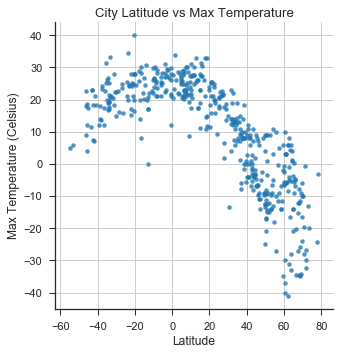
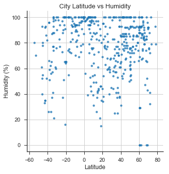
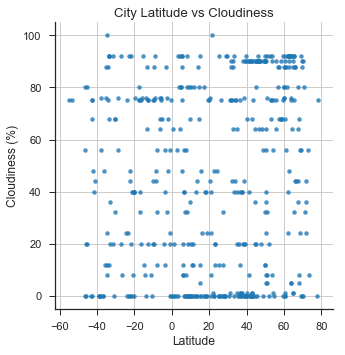
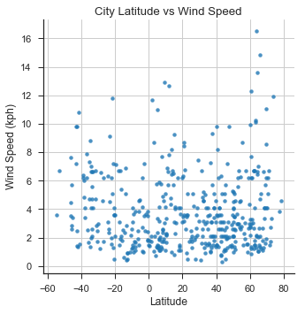

# Analysis

1) The Latitude vs Temperature Plot shows that the temperatures are lower as you go further away from the equator.

2) The Latitude vs Temperature Plot also shows significantly lower temps north of the equator, since it is winter north of the equator and summer south of the equator.

3) The 3 other plots show that humidity, cloudiness, and wind speed are not effected by how far away a city is from the equator.


```python
# Import Dependencies
import pandas as pd
import random
import json
import time
import requests as req
import matplotlib.pyplot as plt
import seaborn as sns
from citipy import citipy
```

# Generate Cities List


```python
# Lists to store data
l1 = []
l2 = []
citipy_data = []
cities = []
cities_samples = []

# Loop to generate sampling of Lat/Long Data
while len(l1) < 2000:
    l1a = random.uniform(-90,90)
    l1.append(l1a)
while len(l2) < 2000:
    l2a = random.uniform(-180,180)
    l2.append(l2a)

coordinates = zip(l1, l2)

# Use CitiPy to get name of nearest city to Lat/Long coordinates
for coordinates_pair in coordinates:
    lat, lon = coordinates_pair
    citipy_data.append(citipy.nearest_city(lat, lon))
    cities.append(citipy.nearest_city(lat, lon).city_name)

# Create a city name list that contains no duplicates
for city in cities:
    if city not in cities_samples:
        if len(cities_samples) < 500:
            cities_samples.append(city)
```

# Perform API Calls


```python
# Create lists to store weather data
latitude = []
temperature = []
humidity = []
cloudiness = []
windspeed = []
city_list = []

# Save config information for openweathermap API
api_key = "e350ecd0f8457e05a2d7e54f90968b59"
url = "http://api.openweathermap.org/data/2.5/weather?"
units = "metric"

# Build partial query URL
query_url = url + "appid=" + api_key + "&units=" + units + "&q="

# Get weather data from API

record_count = 1
group_number = 1

for city in cities_samples:
    print("Fetching record number " + str(record_count) + " of group "+ str(group_number) + " for " + city)
    print(query_url + city)
    try:
        response = req.get(query_url + city).json()
        latitude.append(response["coord"]["lat"])
        temperature.append(response["main"]["temp_max"])
        humidity.append(response["main"]["humidity"])
        cloudiness.append(response["clouds"]["all"])
        windspeed.append(response["wind"]["speed"])
        city_list.append(city)
        
    except:
        print(city + ":  This is not the city you are looking for")
        continue
            
    if record_count < 50:
        record_count = record_count + 1
    elif record_count == 50:
        time.sleep(45)
        record_count = 1
        group_number = group_number + 1

print("---------------------------------------")
print("---------------Finished----------------")
print("---------------------------------------")
```

    Fetching record number 1 of group 1 for atar
    http://api.openweathermap.org/data/2.5/weather?appid=e350ecd0f8457e05a2d7e54f90968b59&units=metric&q=atar
    Fetching record number 2 of group 1 for ancud
    http://api.openweathermap.org/data/2.5/weather?appid=e350ecd0f8457e05a2d7e54f90968b59&units=metric&q=ancud
    Fetching record number 3 of group 1 for punta arenas
    http://api.openweathermap.org/data/2.5/weather?appid=e350ecd0f8457e05a2d7e54f90968b59&units=metric&q=punta arenas
    Fetching record number 4 of group 1 for codrington
    http://api.openweathermap.org/data/2.5/weather?appid=e350ecd0f8457e05a2d7e54f90968b59&units=metric&q=codrington
    Fetching record number 5 of group 1 for venado tuerto
    http://api.openweathermap.org/data/2.5/weather?appid=e350ecd0f8457e05a2d7e54f90968b59&units=metric&q=venado tuerto
    Fetching record number 6 of group 1 for khatanga
    http://api.openweathermap.org/data/2.5/weather?appid=e350ecd0f8457e05a2d7e54f90968b59&units=metric&q=khatanga
    Fetching record number 7 of group 1 for derzhavinsk
    http://api.openweathermap.org/data/2.5/weather?appid=e350ecd0f8457e05a2d7e54f90968b59&units=metric&q=derzhavinsk
    Fetching record number 8 of group 1 for bluff
    http://api.openweathermap.org/data/2.5/weather?appid=e350ecd0f8457e05a2d7e54f90968b59&units=metric&q=bluff
    Fetching record number 9 of group 1 for tomohon
    http://api.openweathermap.org/data/2.5/weather?appid=e350ecd0f8457e05a2d7e54f90968b59&units=metric&q=tomohon
    Fetching record number 10 of group 1 for atuona
    http://api.openweathermap.org/data/2.5/weather?appid=e350ecd0f8457e05a2d7e54f90968b59&units=metric&q=atuona
    Fetching record number 11 of group 1 for rikitea
    http://api.openweathermap.org/data/2.5/weather?appid=e350ecd0f8457e05a2d7e54f90968b59&units=metric&q=rikitea
    Fetching record number 12 of group 1 for jamestown
    http://api.openweathermap.org/data/2.5/weather?appid=e350ecd0f8457e05a2d7e54f90968b59&units=metric&q=jamestown
    Fetching record number 13 of group 1 for saskylakh
    http://api.openweathermap.org/data/2.5/weather?appid=e350ecd0f8457e05a2d7e54f90968b59&units=metric&q=saskylakh
    Fetching record number 14 of group 1 for touros
    http://api.openweathermap.org/data/2.5/weather?appid=e350ecd0f8457e05a2d7e54f90968b59&units=metric&q=touros
    Fetching record number 15 of group 1 for wajima
    http://api.openweathermap.org/data/2.5/weather?appid=e350ecd0f8457e05a2d7e54f90968b59&units=metric&q=wajima
    Fetching record number 16 of group 1 for manavalakurichi
    http://api.openweathermap.org/data/2.5/weather?appid=e350ecd0f8457e05a2d7e54f90968b59&units=metric&q=manavalakurichi
    Fetching record number 17 of group 1 for taolanaro
    http://api.openweathermap.org/data/2.5/weather?appid=e350ecd0f8457e05a2d7e54f90968b59&units=metric&q=taolanaro
    taolanaro:  This is not the city you are looking for
    Fetching record number 17 of group 1 for provideniya
    http://api.openweathermap.org/data/2.5/weather?appid=e350ecd0f8457e05a2d7e54f90968b59&units=metric&q=provideniya
    Fetching record number 18 of group 1 for dikson
    http://api.openweathermap.org/data/2.5/weather?appid=e350ecd0f8457e05a2d7e54f90968b59&units=metric&q=dikson
    Fetching record number 19 of group 1 for mongagua
    http://api.openweathermap.org/data/2.5/weather?appid=e350ecd0f8457e05a2d7e54f90968b59&units=metric&q=mongagua
    Fetching record number 20 of group 1 for cabo san lucas
    http://api.openweathermap.org/data/2.5/weather?appid=e350ecd0f8457e05a2d7e54f90968b59&units=metric&q=cabo san lucas
    Fetching record number 21 of group 1 for hermanus
    http://api.openweathermap.org/data/2.5/weather?appid=e350ecd0f8457e05a2d7e54f90968b59&units=metric&q=hermanus
    Fetching record number 22 of group 1 for vaini
    http://api.openweathermap.org/data/2.5/weather?appid=e350ecd0f8457e05a2d7e54f90968b59&units=metric&q=vaini
    Fetching record number 23 of group 1 for kapaa
    http://api.openweathermap.org/data/2.5/weather?appid=e350ecd0f8457e05a2d7e54f90968b59&units=metric&q=kapaa
    Fetching record number 24 of group 1 for ushuaia
    http://api.openweathermap.org/data/2.5/weather?appid=e350ecd0f8457e05a2d7e54f90968b59&units=metric&q=ushuaia
    Fetching record number 25 of group 1 for chuy
    http://api.openweathermap.org/data/2.5/weather?appid=e350ecd0f8457e05a2d7e54f90968b59&units=metric&q=chuy
    Fetching record number 26 of group 1 for jaboticabal
    http://api.openweathermap.org/data/2.5/weather?appid=e350ecd0f8457e05a2d7e54f90968b59&units=metric&q=jaboticabal
    Fetching record number 27 of group 1 for sao filipe
    http://api.openweathermap.org/data/2.5/weather?appid=e350ecd0f8457e05a2d7e54f90968b59&units=metric&q=sao filipe
    Fetching record number 28 of group 1 for celestun
    http://api.openweathermap.org/data/2.5/weather?appid=e350ecd0f8457e05a2d7e54f90968b59&units=metric&q=celestun
    Fetching record number 29 of group 1 for puerto narino
    http://api.openweathermap.org/data/2.5/weather?appid=e350ecd0f8457e05a2d7e54f90968b59&units=metric&q=puerto narino
    Fetching record number 30 of group 1 for sao jose da coroa grande
    http://api.openweathermap.org/data/2.5/weather?appid=e350ecd0f8457e05a2d7e54f90968b59&units=metric&q=sao jose da coroa grande
    Fetching record number 31 of group 1 for canto do buriti
    http://api.openweathermap.org/data/2.5/weather?appid=e350ecd0f8457e05a2d7e54f90968b59&units=metric&q=canto do buriti
    Fetching record number 32 of group 1 for port elizabeth
    http://api.openweathermap.org/data/2.5/weather?appid=e350ecd0f8457e05a2d7e54f90968b59&units=metric&q=port elizabeth
    Fetching record number 33 of group 1 for barrow
    http://api.openweathermap.org/data/2.5/weather?appid=e350ecd0f8457e05a2d7e54f90968b59&units=metric&q=barrow
    Fetching record number 34 of group 1 for plavinas
    http://api.openweathermap.org/data/2.5/weather?appid=e350ecd0f8457e05a2d7e54f90968b59&units=metric&q=plavinas
    Fetching record number 35 of group 1 for busselton
    http://api.openweathermap.org/data/2.5/weather?appid=e350ecd0f8457e05a2d7e54f90968b59&units=metric&q=busselton
    Fetching record number 36 of group 1 for upernavik
    http://api.openweathermap.org/data/2.5/weather?appid=e350ecd0f8457e05a2d7e54f90968b59&units=metric&q=upernavik
    Fetching record number 37 of group 1 for yellowknife
    http://api.openweathermap.org/data/2.5/weather?appid=e350ecd0f8457e05a2d7e54f90968b59&units=metric&q=yellowknife
    Fetching record number 38 of group 1 for husavik
    http://api.openweathermap.org/data/2.5/weather?appid=e350ecd0f8457e05a2d7e54f90968b59&units=metric&q=husavik
    Fetching record number 39 of group 1 for mitu
    http://api.openweathermap.org/data/2.5/weather?appid=e350ecd0f8457e05a2d7e54f90968b59&units=metric&q=mitu
    Fetching record number 40 of group 1 for temyasovo
    http://api.openweathermap.org/data/2.5/weather?appid=e350ecd0f8457e05a2d7e54f90968b59&units=metric&q=temyasovo
    Fetching record number 41 of group 1 for pangnirtung
    http://api.openweathermap.org/data/2.5/weather?appid=e350ecd0f8457e05a2d7e54f90968b59&units=metric&q=pangnirtung
    Fetching record number 42 of group 1 for mount gambier
    http://api.openweathermap.org/data/2.5/weather?appid=e350ecd0f8457e05a2d7e54f90968b59&units=metric&q=mount gambier
    Fetching record number 43 of group 1 for bredasdorp
    http://api.openweathermap.org/data/2.5/weather?appid=e350ecd0f8457e05a2d7e54f90968b59&units=metric&q=bredasdorp
    Fetching record number 44 of group 1 for saldanha
    http://api.openweathermap.org/data/2.5/weather?appid=e350ecd0f8457e05a2d7e54f90968b59&units=metric&q=saldanha
    Fetching record number 45 of group 1 for butaritari
    http://api.openweathermap.org/data/2.5/weather?appid=e350ecd0f8457e05a2d7e54f90968b59&units=metric&q=butaritari
    Fetching record number 46 of group 1 for barentsburg
    http://api.openweathermap.org/data/2.5/weather?appid=e350ecd0f8457e05a2d7e54f90968b59&units=metric&q=barentsburg
    barentsburg:  This is not the city you are looking for
    Fetching record number 46 of group 1 for mataura
    http://api.openweathermap.org/data/2.5/weather?appid=e350ecd0f8457e05a2d7e54f90968b59&units=metric&q=mataura
    Fetching record number 47 of group 1 for lesosibirsk
    http://api.openweathermap.org/data/2.5/weather?appid=e350ecd0f8457e05a2d7e54f90968b59&units=metric&q=lesosibirsk
    Fetching record number 48 of group 1 for hobart
    http://api.openweathermap.org/data/2.5/weather?appid=e350ecd0f8457e05a2d7e54f90968b59&units=metric&q=hobart
    Fetching record number 49 of group 1 for college
    http://api.openweathermap.org/data/2.5/weather?appid=e350ecd0f8457e05a2d7e54f90968b59&units=metric&q=college
    Fetching record number 50 of group 1 for castro
    http://api.openweathermap.org/data/2.5/weather?appid=e350ecd0f8457e05a2d7e54f90968b59&units=metric&q=castro
    Fetching record number 1 of group 2 for nikolskoye
    http://api.openweathermap.org/data/2.5/weather?appid=e350ecd0f8457e05a2d7e54f90968b59&units=metric&q=nikolskoye
    Fetching record number 2 of group 2 for port blair
    http://api.openweathermap.org/data/2.5/weather?appid=e350ecd0f8457e05a2d7e54f90968b59&units=metric&q=port blair
    Fetching record number 3 of group 2 for zaragoza
    http://api.openweathermap.org/data/2.5/weather?appid=e350ecd0f8457e05a2d7e54f90968b59&units=metric&q=zaragoza
    Fetching record number 4 of group 2 for ust-kamchatsk
    http://api.openweathermap.org/data/2.5/weather?appid=e350ecd0f8457e05a2d7e54f90968b59&units=metric&q=ust-kamchatsk
    ust-kamchatsk:  This is not the city you are looking for
    Fetching record number 4 of group 2 for kaitangata
    http://api.openweathermap.org/data/2.5/weather?appid=e350ecd0f8457e05a2d7e54f90968b59&units=metric&q=kaitangata
    Fetching record number 5 of group 2 for cidreira
    http://api.openweathermap.org/data/2.5/weather?appid=e350ecd0f8457e05a2d7e54f90968b59&units=metric&q=cidreira
    Fetching record number 6 of group 2 for hihifo
    http://api.openweathermap.org/data/2.5/weather?appid=e350ecd0f8457e05a2d7e54f90968b59&units=metric&q=hihifo
    hihifo:  This is not the city you are looking for
    Fetching record number 6 of group 2 for udachnyy
    http://api.openweathermap.org/data/2.5/weather?appid=e350ecd0f8457e05a2d7e54f90968b59&units=metric&q=udachnyy
    Fetching record number 7 of group 2 for zlatoustovsk
    http://api.openweathermap.org/data/2.5/weather?appid=e350ecd0f8457e05a2d7e54f90968b59&units=metric&q=zlatoustovsk
    zlatoustovsk:  This is not the city you are looking for
    Fetching record number 7 of group 2 for weligama
    http://api.openweathermap.org/data/2.5/weather?appid=e350ecd0f8457e05a2d7e54f90968b59&units=metric&q=weligama
    Fetching record number 8 of group 2 for tricase
    http://api.openweathermap.org/data/2.5/weather?appid=e350ecd0f8457e05a2d7e54f90968b59&units=metric&q=tricase
    Fetching record number 9 of group 2 for fort stewart
    http://api.openweathermap.org/data/2.5/weather?appid=e350ecd0f8457e05a2d7e54f90968b59&units=metric&q=fort stewart
    Fetching record number 10 of group 2 for burica
    http://api.openweathermap.org/data/2.5/weather?appid=e350ecd0f8457e05a2d7e54f90968b59&units=metric&q=burica
    burica:  This is not the city you are looking for
    Fetching record number 10 of group 2 for tual
    http://api.openweathermap.org/data/2.5/weather?appid=e350ecd0f8457e05a2d7e54f90968b59&units=metric&q=tual
    Fetching record number 11 of group 2 for ponta do sol
    http://api.openweathermap.org/data/2.5/weather?appid=e350ecd0f8457e05a2d7e54f90968b59&units=metric&q=ponta do sol
    Fetching record number 12 of group 2 for muisne
    http://api.openweathermap.org/data/2.5/weather?appid=e350ecd0f8457e05a2d7e54f90968b59&units=metric&q=muisne
    Fetching record number 13 of group 2 for roald
    http://api.openweathermap.org/data/2.5/weather?appid=e350ecd0f8457e05a2d7e54f90968b59&units=metric&q=roald
    Fetching record number 14 of group 2 for lowestoft
    http://api.openweathermap.org/data/2.5/weather?appid=e350ecd0f8457e05a2d7e54f90968b59&units=metric&q=lowestoft
    Fetching record number 15 of group 2 for lasa
    http://api.openweathermap.org/data/2.5/weather?appid=e350ecd0f8457e05a2d7e54f90968b59&units=metric&q=lasa
    Fetching record number 16 of group 2 for verkhnyaya inta
    http://api.openweathermap.org/data/2.5/weather?appid=e350ecd0f8457e05a2d7e54f90968b59&units=metric&q=verkhnyaya inta
    Fetching record number 17 of group 2 for pacific grove
    http://api.openweathermap.org/data/2.5/weather?appid=e350ecd0f8457e05a2d7e54f90968b59&units=metric&q=pacific grove
    Fetching record number 18 of group 2 for soyo
    http://api.openweathermap.org/data/2.5/weather?appid=e350ecd0f8457e05a2d7e54f90968b59&units=metric&q=soyo
    Fetching record number 19 of group 2 for mayo
    http://api.openweathermap.org/data/2.5/weather?appid=e350ecd0f8457e05a2d7e54f90968b59&units=metric&q=mayo
    Fetching record number 20 of group 2 for avarua
    http://api.openweathermap.org/data/2.5/weather?appid=e350ecd0f8457e05a2d7e54f90968b59&units=metric&q=avarua
    Fetching record number 21 of group 2 for samusu
    http://api.openweathermap.org/data/2.5/weather?appid=e350ecd0f8457e05a2d7e54f90968b59&units=metric&q=samusu
    samusu:  This is not the city you are looking for
    Fetching record number 21 of group 2 for yamada
    http://api.openweathermap.org/data/2.5/weather?appid=e350ecd0f8457e05a2d7e54f90968b59&units=metric&q=yamada
    Fetching record number 22 of group 2 for attawapiskat
    http://api.openweathermap.org/data/2.5/weather?appid=e350ecd0f8457e05a2d7e54f90968b59&units=metric&q=attawapiskat
    attawapiskat:  This is not the city you are looking for
    Fetching record number 22 of group 2 for dafeng
    http://api.openweathermap.org/data/2.5/weather?appid=e350ecd0f8457e05a2d7e54f90968b59&units=metric&q=dafeng
    Fetching record number 23 of group 2 for souillac
    http://api.openweathermap.org/data/2.5/weather?appid=e350ecd0f8457e05a2d7e54f90968b59&units=metric&q=souillac
    Fetching record number 24 of group 2 for tura
    http://api.openweathermap.org/data/2.5/weather?appid=e350ecd0f8457e05a2d7e54f90968b59&units=metric&q=tura
    Fetching record number 25 of group 2 for port hardy
    http://api.openweathermap.org/data/2.5/weather?appid=e350ecd0f8457e05a2d7e54f90968b59&units=metric&q=port hardy
    Fetching record number 26 of group 2 for tiksi
    http://api.openweathermap.org/data/2.5/weather?appid=e350ecd0f8457e05a2d7e54f90968b59&units=metric&q=tiksi
    Fetching record number 27 of group 2 for krasnorechenskiy
    http://api.openweathermap.org/data/2.5/weather?appid=e350ecd0f8457e05a2d7e54f90968b59&units=metric&q=krasnorechenskiy
    Fetching record number 28 of group 2 for blonduos
    http://api.openweathermap.org/data/2.5/weather?appid=e350ecd0f8457e05a2d7e54f90968b59&units=metric&q=blonduos
    blonduos:  This is not the city you are looking for
    Fetching record number 28 of group 2 for luanshya
    http://api.openweathermap.org/data/2.5/weather?appid=e350ecd0f8457e05a2d7e54f90968b59&units=metric&q=luanshya
    Fetching record number 29 of group 2 for new norfolk
    http://api.openweathermap.org/data/2.5/weather?appid=e350ecd0f8457e05a2d7e54f90968b59&units=metric&q=new norfolk
    Fetching record number 30 of group 2 for launceston
    http://api.openweathermap.org/data/2.5/weather?appid=e350ecd0f8457e05a2d7e54f90968b59&units=metric&q=launceston
    Fetching record number 31 of group 2 for sfantu gheorghe
    http://api.openweathermap.org/data/2.5/weather?appid=e350ecd0f8457e05a2d7e54f90968b59&units=metric&q=sfantu gheorghe
    Fetching record number 32 of group 2 for puerto ayora
    http://api.openweathermap.org/data/2.5/weather?appid=e350ecd0f8457e05a2d7e54f90968b59&units=metric&q=puerto ayora
    Fetching record number 33 of group 2 for cape town
    http://api.openweathermap.org/data/2.5/weather?appid=e350ecd0f8457e05a2d7e54f90968b59&units=metric&q=cape town
    Fetching record number 34 of group 2 for hilo
    http://api.openweathermap.org/data/2.5/weather?appid=e350ecd0f8457e05a2d7e54f90968b59&units=metric&q=hilo
    Fetching record number 35 of group 2 for geraldton
    http://api.openweathermap.org/data/2.5/weather?appid=e350ecd0f8457e05a2d7e54f90968b59&units=metric&q=geraldton
    Fetching record number 36 of group 2 for kungurtug
    http://api.openweathermap.org/data/2.5/weather?appid=e350ecd0f8457e05a2d7e54f90968b59&units=metric&q=kungurtug
    Fetching record number 37 of group 2 for palabuhanratu
    http://api.openweathermap.org/data/2.5/weather?appid=e350ecd0f8457e05a2d7e54f90968b59&units=metric&q=palabuhanratu
    palabuhanratu:  This is not the city you are looking for
    Fetching record number 37 of group 2 for hasaki
    http://api.openweathermap.org/data/2.5/weather?appid=e350ecd0f8457e05a2d7e54f90968b59&units=metric&q=hasaki
    Fetching record number 38 of group 2 for foso
    http://api.openweathermap.org/data/2.5/weather?appid=e350ecd0f8457e05a2d7e54f90968b59&units=metric&q=foso
    Fetching record number 39 of group 2 for ambagarh chauki
    http://api.openweathermap.org/data/2.5/weather?appid=e350ecd0f8457e05a2d7e54f90968b59&units=metric&q=ambagarh chauki
    Fetching record number 40 of group 2 for lebu
    http://api.openweathermap.org/data/2.5/weather?appid=e350ecd0f8457e05a2d7e54f90968b59&units=metric&q=lebu
    Fetching record number 41 of group 2 for vila velha
    http://api.openweathermap.org/data/2.5/weather?appid=e350ecd0f8457e05a2d7e54f90968b59&units=metric&q=vila velha
    Fetching record number 42 of group 2 for carnarvon
    http://api.openweathermap.org/data/2.5/weather?appid=e350ecd0f8457e05a2d7e54f90968b59&units=metric&q=carnarvon
    Fetching record number 43 of group 2 for xochihuehuetlan
    http://api.openweathermap.org/data/2.5/weather?appid=e350ecd0f8457e05a2d7e54f90968b59&units=metric&q=xochihuehuetlan
    Fetching record number 44 of group 2 for mahebourg
    http://api.openweathermap.org/data/2.5/weather?appid=e350ecd0f8457e05a2d7e54f90968b59&units=metric&q=mahebourg
    Fetching record number 45 of group 2 for sentyabrskiy
    http://api.openweathermap.org/data/2.5/weather?appid=e350ecd0f8457e05a2d7e54f90968b59&units=metric&q=sentyabrskiy
    sentyabrskiy:  This is not the city you are looking for
    Fetching record number 45 of group 2 for alexandria
    http://api.openweathermap.org/data/2.5/weather?appid=e350ecd0f8457e05a2d7e54f90968b59&units=metric&q=alexandria
    Fetching record number 46 of group 2 for boli
    http://api.openweathermap.org/data/2.5/weather?appid=e350ecd0f8457e05a2d7e54f90968b59&units=metric&q=boli
    Fetching record number 47 of group 2 for jalu
    http://api.openweathermap.org/data/2.5/weather?appid=e350ecd0f8457e05a2d7e54f90968b59&units=metric&q=jalu
    Fetching record number 48 of group 2 for kaabong
    http://api.openweathermap.org/data/2.5/weather?appid=e350ecd0f8457e05a2d7e54f90968b59&units=metric&q=kaabong
    Fetching record number 49 of group 2 for aloleng
    http://api.openweathermap.org/data/2.5/weather?appid=e350ecd0f8457e05a2d7e54f90968b59&units=metric&q=aloleng
    Fetching record number 50 of group 2 for nagapattinam
    http://api.openweathermap.org/data/2.5/weather?appid=e350ecd0f8457e05a2d7e54f90968b59&units=metric&q=nagapattinam
    Fetching record number 1 of group 3 for takoradi
    http://api.openweathermap.org/data/2.5/weather?appid=e350ecd0f8457e05a2d7e54f90968b59&units=metric&q=takoradi
    Fetching record number 2 of group 3 for cherskiy
    http://api.openweathermap.org/data/2.5/weather?appid=e350ecd0f8457e05a2d7e54f90968b59&units=metric&q=cherskiy
    Fetching record number 3 of group 3 for asau
    http://api.openweathermap.org/data/2.5/weather?appid=e350ecd0f8457e05a2d7e54f90968b59&units=metric&q=asau
    asau:  This is not the city you are looking for
    Fetching record number 3 of group 3 for dogondoutchi
    http://api.openweathermap.org/data/2.5/weather?appid=e350ecd0f8457e05a2d7e54f90968b59&units=metric&q=dogondoutchi
    Fetching record number 4 of group 3 for ilulissat
    http://api.openweathermap.org/data/2.5/weather?appid=e350ecd0f8457e05a2d7e54f90968b59&units=metric&q=ilulissat
    Fetching record number 5 of group 3 for east london
    http://api.openweathermap.org/data/2.5/weather?appid=e350ecd0f8457e05a2d7e54f90968b59&units=metric&q=east london
    Fetching record number 6 of group 3 for poum
    http://api.openweathermap.org/data/2.5/weather?appid=e350ecd0f8457e05a2d7e54f90968b59&units=metric&q=poum
    Fetching record number 7 of group 3 for katsuura
    http://api.openweathermap.org/data/2.5/weather?appid=e350ecd0f8457e05a2d7e54f90968b59&units=metric&q=katsuura
    Fetching record number 8 of group 3 for illoqqortoormiut
    http://api.openweathermap.org/data/2.5/weather?appid=e350ecd0f8457e05a2d7e54f90968b59&units=metric&q=illoqqortoormiut
    illoqqortoormiut:  This is not the city you are looking for
    Fetching record number 8 of group 3 for galiwinku
    http://api.openweathermap.org/data/2.5/weather?appid=e350ecd0f8457e05a2d7e54f90968b59&units=metric&q=galiwinku
    galiwinku:  This is not the city you are looking for
    Fetching record number 8 of group 3 for caravelas
    http://api.openweathermap.org/data/2.5/weather?appid=e350ecd0f8457e05a2d7e54f90968b59&units=metric&q=caravelas
    Fetching record number 9 of group 3 for narsaq
    http://api.openweathermap.org/data/2.5/weather?appid=e350ecd0f8457e05a2d7e54f90968b59&units=metric&q=narsaq
    Fetching record number 10 of group 3 for labutta
    http://api.openweathermap.org/data/2.5/weather?appid=e350ecd0f8457e05a2d7e54f90968b59&units=metric&q=labutta
    labutta:  This is not the city you are looking for
    Fetching record number 10 of group 3 for albany
    http://api.openweathermap.org/data/2.5/weather?appid=e350ecd0f8457e05a2d7e54f90968b59&units=metric&q=albany
    Fetching record number 11 of group 3 for sur
    http://api.openweathermap.org/data/2.5/weather?appid=e350ecd0f8457e05a2d7e54f90968b59&units=metric&q=sur
    Fetching record number 12 of group 3 for pevek
    http://api.openweathermap.org/data/2.5/weather?appid=e350ecd0f8457e05a2d7e54f90968b59&units=metric&q=pevek
    Fetching record number 13 of group 3 for cap malheureux
    http://api.openweathermap.org/data/2.5/weather?appid=e350ecd0f8457e05a2d7e54f90968b59&units=metric&q=cap malheureux
    Fetching record number 14 of group 3 for nipawin
    http://api.openweathermap.org/data/2.5/weather?appid=e350ecd0f8457e05a2d7e54f90968b59&units=metric&q=nipawin
    Fetching record number 15 of group 3 for salamiyah
    http://api.openweathermap.org/data/2.5/weather?appid=e350ecd0f8457e05a2d7e54f90968b59&units=metric&q=salamiyah
    Fetching record number 16 of group 3 for kendari
    http://api.openweathermap.org/data/2.5/weather?appid=e350ecd0f8457e05a2d7e54f90968b59&units=metric&q=kendari
    Fetching record number 17 of group 3 for kruisfontein
    http://api.openweathermap.org/data/2.5/weather?appid=e350ecd0f8457e05a2d7e54f90968b59&units=metric&q=kruisfontein
    Fetching record number 18 of group 3 for mason city
    http://api.openweathermap.org/data/2.5/weather?appid=e350ecd0f8457e05a2d7e54f90968b59&units=metric&q=mason city
    Fetching record number 19 of group 3 for timra
    http://api.openweathermap.org/data/2.5/weather?appid=e350ecd0f8457e05a2d7e54f90968b59&units=metric&q=timra
    Fetching record number 20 of group 3 for sitka
    http://api.openweathermap.org/data/2.5/weather?appid=e350ecd0f8457e05a2d7e54f90968b59&units=metric&q=sitka
    Fetching record number 21 of group 3 for aksha
    http://api.openweathermap.org/data/2.5/weather?appid=e350ecd0f8457e05a2d7e54f90968b59&units=metric&q=aksha
    Fetching record number 22 of group 3 for punta cardon
    http://api.openweathermap.org/data/2.5/weather?appid=e350ecd0f8457e05a2d7e54f90968b59&units=metric&q=punta cardon
    Fetching record number 23 of group 3 for khanpur
    http://api.openweathermap.org/data/2.5/weather?appid=e350ecd0f8457e05a2d7e54f90968b59&units=metric&q=khanpur
    Fetching record number 24 of group 3 for longyearbyen
    http://api.openweathermap.org/data/2.5/weather?appid=e350ecd0f8457e05a2d7e54f90968b59&units=metric&q=longyearbyen
    Fetching record number 25 of group 3 for tuktoyaktuk
    http://api.openweathermap.org/data/2.5/weather?appid=e350ecd0f8457e05a2d7e54f90968b59&units=metric&q=tuktoyaktuk
    Fetching record number 26 of group 3 for bethel
    http://api.openweathermap.org/data/2.5/weather?appid=e350ecd0f8457e05a2d7e54f90968b59&units=metric&q=bethel
    Fetching record number 27 of group 3 for kayerkan
    http://api.openweathermap.org/data/2.5/weather?appid=e350ecd0f8457e05a2d7e54f90968b59&units=metric&q=kayerkan
    Fetching record number 28 of group 3 for vestmannaeyjar
    http://api.openweathermap.org/data/2.5/weather?appid=e350ecd0f8457e05a2d7e54f90968b59&units=metric&q=vestmannaeyjar
    Fetching record number 29 of group 3 for duffel
    http://api.openweathermap.org/data/2.5/weather?appid=e350ecd0f8457e05a2d7e54f90968b59&units=metric&q=duffel
    Fetching record number 30 of group 3 for lamlash
    http://api.openweathermap.org/data/2.5/weather?appid=e350ecd0f8457e05a2d7e54f90968b59&units=metric&q=lamlash
    Fetching record number 31 of group 3 for kodiak
    http://api.openweathermap.org/data/2.5/weather?appid=e350ecd0f8457e05a2d7e54f90968b59&units=metric&q=kodiak
    Fetching record number 32 of group 3 for livingston
    http://api.openweathermap.org/data/2.5/weather?appid=e350ecd0f8457e05a2d7e54f90968b59&units=metric&q=livingston
    Fetching record number 33 of group 3 for saint-augustin
    http://api.openweathermap.org/data/2.5/weather?appid=e350ecd0f8457e05a2d7e54f90968b59&units=metric&q=saint-augustin
    Fetching record number 34 of group 3 for nouadhibou
    http://api.openweathermap.org/data/2.5/weather?appid=e350ecd0f8457e05a2d7e54f90968b59&units=metric&q=nouadhibou
    Fetching record number 35 of group 3 for port-gentil
    http://api.openweathermap.org/data/2.5/weather?appid=e350ecd0f8457e05a2d7e54f90968b59&units=metric&q=port-gentil
    Fetching record number 36 of group 3 for ambad
    http://api.openweathermap.org/data/2.5/weather?appid=e350ecd0f8457e05a2d7e54f90968b59&units=metric&q=ambad
    Fetching record number 37 of group 3 for doha
    http://api.openweathermap.org/data/2.5/weather?appid=e350ecd0f8457e05a2d7e54f90968b59&units=metric&q=doha
    Fetching record number 38 of group 3 for hokitika
    http://api.openweathermap.org/data/2.5/weather?appid=e350ecd0f8457e05a2d7e54f90968b59&units=metric&q=hokitika
    Fetching record number 39 of group 3 for znamenskoye
    http://api.openweathermap.org/data/2.5/weather?appid=e350ecd0f8457e05a2d7e54f90968b59&units=metric&q=znamenskoye
    Fetching record number 40 of group 3 for nantucket
    http://api.openweathermap.org/data/2.5/weather?appid=e350ecd0f8457e05a2d7e54f90968b59&units=metric&q=nantucket
    Fetching record number 41 of group 3 for georgetown
    http://api.openweathermap.org/data/2.5/weather?appid=e350ecd0f8457e05a2d7e54f90968b59&units=metric&q=georgetown
    Fetching record number 42 of group 3 for bahia blanca
    http://api.openweathermap.org/data/2.5/weather?appid=e350ecd0f8457e05a2d7e54f90968b59&units=metric&q=bahia blanca
    Fetching record number 43 of group 3 for moroni
    http://api.openweathermap.org/data/2.5/weather?appid=e350ecd0f8457e05a2d7e54f90968b59&units=metric&q=moroni
    Fetching record number 44 of group 3 for port alfred
    http://api.openweathermap.org/data/2.5/weather?appid=e350ecd0f8457e05a2d7e54f90968b59&units=metric&q=port alfred
    Fetching record number 45 of group 3 for mar del plata
    http://api.openweathermap.org/data/2.5/weather?appid=e350ecd0f8457e05a2d7e54f90968b59&units=metric&q=mar del plata
    Fetching record number 46 of group 3 for llanes
    http://api.openweathermap.org/data/2.5/weather?appid=e350ecd0f8457e05a2d7e54f90968b59&units=metric&q=llanes
    Fetching record number 47 of group 3 for san patricio
    http://api.openweathermap.org/data/2.5/weather?appid=e350ecd0f8457e05a2d7e54f90968b59&units=metric&q=san patricio
    Fetching record number 48 of group 3 for caala
    http://api.openweathermap.org/data/2.5/weather?appid=e350ecd0f8457e05a2d7e54f90968b59&units=metric&q=caala
    Fetching record number 49 of group 3 for grand river south east
    http://api.openweathermap.org/data/2.5/weather?appid=e350ecd0f8457e05a2d7e54f90968b59&units=metric&q=grand river south east
    grand river south east:  This is not the city you are looking for
    Fetching record number 49 of group 3 for tsihombe
    http://api.openweathermap.org/data/2.5/weather?appid=e350ecd0f8457e05a2d7e54f90968b59&units=metric&q=tsihombe
    tsihombe:  This is not the city you are looking for
    Fetching record number 49 of group 3 for sorong
    http://api.openweathermap.org/data/2.5/weather?appid=e350ecd0f8457e05a2d7e54f90968b59&units=metric&q=sorong
    Fetching record number 50 of group 3 for yinchuan
    http://api.openweathermap.org/data/2.5/weather?appid=e350ecd0f8457e05a2d7e54f90968b59&units=metric&q=yinchuan
    Fetching record number 1 of group 4 for ta khmau
    http://api.openweathermap.org/data/2.5/weather?appid=e350ecd0f8457e05a2d7e54f90968b59&units=metric&q=ta khmau
    Fetching record number 2 of group 4 for pisco
    http://api.openweathermap.org/data/2.5/weather?appid=e350ecd0f8457e05a2d7e54f90968b59&units=metric&q=pisco
    Fetching record number 3 of group 4 for el carmen de bolivar
    http://api.openweathermap.org/data/2.5/weather?appid=e350ecd0f8457e05a2d7e54f90968b59&units=metric&q=el carmen de bolivar
    Fetching record number 4 of group 4 for eatonton
    http://api.openweathermap.org/data/2.5/weather?appid=e350ecd0f8457e05a2d7e54f90968b59&units=metric&q=eatonton
    Fetching record number 5 of group 4 for ife
    http://api.openweathermap.org/data/2.5/weather?appid=e350ecd0f8457e05a2d7e54f90968b59&units=metric&q=ife
    Fetching record number 6 of group 4 for san ignacio
    http://api.openweathermap.org/data/2.5/weather?appid=e350ecd0f8457e05a2d7e54f90968b59&units=metric&q=san ignacio
    Fetching record number 7 of group 4 for frankfort
    http://api.openweathermap.org/data/2.5/weather?appid=e350ecd0f8457e05a2d7e54f90968b59&units=metric&q=frankfort
    Fetching record number 8 of group 4 for adrar
    http://api.openweathermap.org/data/2.5/weather?appid=e350ecd0f8457e05a2d7e54f90968b59&units=metric&q=adrar
    Fetching record number 9 of group 4 for cairns
    http://api.openweathermap.org/data/2.5/weather?appid=e350ecd0f8457e05a2d7e54f90968b59&units=metric&q=cairns
    Fetching record number 10 of group 4 for wulanhaote
    http://api.openweathermap.org/data/2.5/weather?appid=e350ecd0f8457e05a2d7e54f90968b59&units=metric&q=wulanhaote
    wulanhaote:  This is not the city you are looking for
    Fetching record number 10 of group 4 for basoko
    http://api.openweathermap.org/data/2.5/weather?appid=e350ecd0f8457e05a2d7e54f90968b59&units=metric&q=basoko
    Fetching record number 11 of group 4 for qaanaaq
    http://api.openweathermap.org/data/2.5/weather?appid=e350ecd0f8457e05a2d7e54f90968b59&units=metric&q=qaanaaq
    Fetching record number 12 of group 4 for klaksvik
    http://api.openweathermap.org/data/2.5/weather?appid=e350ecd0f8457e05a2d7e54f90968b59&units=metric&q=klaksvik
    Fetching record number 13 of group 4 for iquique
    http://api.openweathermap.org/data/2.5/weather?appid=e350ecd0f8457e05a2d7e54f90968b59&units=metric&q=iquique
    Fetching record number 14 of group 4 for kavaratti
    http://api.openweathermap.org/data/2.5/weather?appid=e350ecd0f8457e05a2d7e54f90968b59&units=metric&q=kavaratti
    Fetching record number 15 of group 4 for natitingou
    http://api.openweathermap.org/data/2.5/weather?appid=e350ecd0f8457e05a2d7e54f90968b59&units=metric&q=natitingou
    Fetching record number 16 of group 4 for tasiilaq
    http://api.openweathermap.org/data/2.5/weather?appid=e350ecd0f8457e05a2d7e54f90968b59&units=metric&q=tasiilaq
    Fetching record number 17 of group 4 for wunsiedel
    http://api.openweathermap.org/data/2.5/weather?appid=e350ecd0f8457e05a2d7e54f90968b59&units=metric&q=wunsiedel
    Fetching record number 18 of group 4 for gueret
    http://api.openweathermap.org/data/2.5/weather?appid=e350ecd0f8457e05a2d7e54f90968b59&units=metric&q=gueret
    Fetching record number 19 of group 4 for mizan teferi
    http://api.openweathermap.org/data/2.5/weather?appid=e350ecd0f8457e05a2d7e54f90968b59&units=metric&q=mizan teferi
    Fetching record number 20 of group 4 for faya
    http://api.openweathermap.org/data/2.5/weather?appid=e350ecd0f8457e05a2d7e54f90968b59&units=metric&q=faya
    Fetching record number 21 of group 4 for torbat-e jam
    http://api.openweathermap.org/data/2.5/weather?appid=e350ecd0f8457e05a2d7e54f90968b59&units=metric&q=torbat-e jam
    Fetching record number 22 of group 4 for santa fe
    http://api.openweathermap.org/data/2.5/weather?appid=e350ecd0f8457e05a2d7e54f90968b59&units=metric&q=santa fe
    Fetching record number 23 of group 4 for ust-maya
    http://api.openweathermap.org/data/2.5/weather?appid=e350ecd0f8457e05a2d7e54f90968b59&units=metric&q=ust-maya
    Fetching record number 24 of group 4 for arinos
    http://api.openweathermap.org/data/2.5/weather?appid=e350ecd0f8457e05a2d7e54f90968b59&units=metric&q=arinos
    Fetching record number 25 of group 4 for sola
    http://api.openweathermap.org/data/2.5/weather?appid=e350ecd0f8457e05a2d7e54f90968b59&units=metric&q=sola
    Fetching record number 26 of group 4 for fortuna
    http://api.openweathermap.org/data/2.5/weather?appid=e350ecd0f8457e05a2d7e54f90968b59&units=metric&q=fortuna
    Fetching record number 27 of group 4 for necochea
    http://api.openweathermap.org/data/2.5/weather?appid=e350ecd0f8457e05a2d7e54f90968b59&units=metric&q=necochea
    Fetching record number 28 of group 4 for pandan
    http://api.openweathermap.org/data/2.5/weather?appid=e350ecd0f8457e05a2d7e54f90968b59&units=metric&q=pandan
    Fetching record number 29 of group 4 for aksu
    http://api.openweathermap.org/data/2.5/weather?appid=e350ecd0f8457e05a2d7e54f90968b59&units=metric&q=aksu
    Fetching record number 30 of group 4 for chumikan
    http://api.openweathermap.org/data/2.5/weather?appid=e350ecd0f8457e05a2d7e54f90968b59&units=metric&q=chumikan
    Fetching record number 31 of group 4 for kuche
    http://api.openweathermap.org/data/2.5/weather?appid=e350ecd0f8457e05a2d7e54f90968b59&units=metric&q=kuche
    kuche:  This is not the city you are looking for
    Fetching record number 31 of group 4 for bambous virieux
    http://api.openweathermap.org/data/2.5/weather?appid=e350ecd0f8457e05a2d7e54f90968b59&units=metric&q=bambous virieux
    Fetching record number 32 of group 4 for saint-pierre
    http://api.openweathermap.org/data/2.5/weather?appid=e350ecd0f8457e05a2d7e54f90968b59&units=metric&q=saint-pierre
    Fetching record number 33 of group 4 for orebro
    http://api.openweathermap.org/data/2.5/weather?appid=e350ecd0f8457e05a2d7e54f90968b59&units=metric&q=orebro
    Fetching record number 34 of group 4 for palana
    http://api.openweathermap.org/data/2.5/weather?appid=e350ecd0f8457e05a2d7e54f90968b59&units=metric&q=palana
    Fetching record number 35 of group 4 for cervo
    http://api.openweathermap.org/data/2.5/weather?appid=e350ecd0f8457e05a2d7e54f90968b59&units=metric&q=cervo
    Fetching record number 36 of group 4 for cochabamba
    http://api.openweathermap.org/data/2.5/weather?appid=e350ecd0f8457e05a2d7e54f90968b59&units=metric&q=cochabamba
    Fetching record number 37 of group 4 for veraval
    http://api.openweathermap.org/data/2.5/weather?appid=e350ecd0f8457e05a2d7e54f90968b59&units=metric&q=veraval
    Fetching record number 38 of group 4 for thompson
    http://api.openweathermap.org/data/2.5/weather?appid=e350ecd0f8457e05a2d7e54f90968b59&units=metric&q=thompson
    Fetching record number 39 of group 4 for nizhneyansk
    http://api.openweathermap.org/data/2.5/weather?appid=e350ecd0f8457e05a2d7e54f90968b59&units=metric&q=nizhneyansk
    nizhneyansk:  This is not the city you are looking for
    Fetching record number 39 of group 4 for namatanai
    http://api.openweathermap.org/data/2.5/weather?appid=e350ecd0f8457e05a2d7e54f90968b59&units=metric&q=namatanai
    Fetching record number 40 of group 4 for bathsheba
    http://api.openweathermap.org/data/2.5/weather?appid=e350ecd0f8457e05a2d7e54f90968b59&units=metric&q=bathsheba
    Fetching record number 41 of group 4 for dzhusaly
    http://api.openweathermap.org/data/2.5/weather?appid=e350ecd0f8457e05a2d7e54f90968b59&units=metric&q=dzhusaly
    dzhusaly:  This is not the city you are looking for
    Fetching record number 41 of group 4 for weihe
    http://api.openweathermap.org/data/2.5/weather?appid=e350ecd0f8457e05a2d7e54f90968b59&units=metric&q=weihe
    Fetching record number 42 of group 4 for wainwright
    http://api.openweathermap.org/data/2.5/weather?appid=e350ecd0f8457e05a2d7e54f90968b59&units=metric&q=wainwright
    Fetching record number 43 of group 4 for elblag
    http://api.openweathermap.org/data/2.5/weather?appid=e350ecd0f8457e05a2d7e54f90968b59&units=metric&q=elblag
    Fetching record number 44 of group 4 for ribeira grande
    http://api.openweathermap.org/data/2.5/weather?appid=e350ecd0f8457e05a2d7e54f90968b59&units=metric&q=ribeira grande
    Fetching record number 45 of group 4 for hithadhoo
    http://api.openweathermap.org/data/2.5/weather?appid=e350ecd0f8457e05a2d7e54f90968b59&units=metric&q=hithadhoo
    Fetching record number 46 of group 4 for mehamn
    http://api.openweathermap.org/data/2.5/weather?appid=e350ecd0f8457e05a2d7e54f90968b59&units=metric&q=mehamn
    Fetching record number 47 of group 4 for glendive
    http://api.openweathermap.org/data/2.5/weather?appid=e350ecd0f8457e05a2d7e54f90968b59&units=metric&q=glendive
    Fetching record number 48 of group 4 for syracuse
    http://api.openweathermap.org/data/2.5/weather?appid=e350ecd0f8457e05a2d7e54f90968b59&units=metric&q=syracuse
    Fetching record number 49 of group 4 for listvyagi
    http://api.openweathermap.org/data/2.5/weather?appid=e350ecd0f8457e05a2d7e54f90968b59&units=metric&q=listvyagi
    Fetching record number 50 of group 4 for camopi
    http://api.openweathermap.org/data/2.5/weather?appid=e350ecd0f8457e05a2d7e54f90968b59&units=metric&q=camopi
    Fetching record number 1 of group 5 for lere
    http://api.openweathermap.org/data/2.5/weather?appid=e350ecd0f8457e05a2d7e54f90968b59&units=metric&q=lere
    Fetching record number 2 of group 5 for ville-marie
    http://api.openweathermap.org/data/2.5/weather?appid=e350ecd0f8457e05a2d7e54f90968b59&units=metric&q=ville-marie
    Fetching record number 3 of group 5 for maceio
    http://api.openweathermap.org/data/2.5/weather?appid=e350ecd0f8457e05a2d7e54f90968b59&units=metric&q=maceio
    Fetching record number 4 of group 5 for puerto baquerizo moreno
    http://api.openweathermap.org/data/2.5/weather?appid=e350ecd0f8457e05a2d7e54f90968b59&units=metric&q=puerto baquerizo moreno
    Fetching record number 5 of group 5 for luderitz
    http://api.openweathermap.org/data/2.5/weather?appid=e350ecd0f8457e05a2d7e54f90968b59&units=metric&q=luderitz
    Fetching record number 6 of group 5 for ostrovnoy
    http://api.openweathermap.org/data/2.5/weather?appid=e350ecd0f8457e05a2d7e54f90968b59&units=metric&q=ostrovnoy
    Fetching record number 7 of group 5 for dakar
    http://api.openweathermap.org/data/2.5/weather?appid=e350ecd0f8457e05a2d7e54f90968b59&units=metric&q=dakar
    Fetching record number 8 of group 5 for meulaboh
    http://api.openweathermap.org/data/2.5/weather?appid=e350ecd0f8457e05a2d7e54f90968b59&units=metric&q=meulaboh
    Fetching record number 9 of group 5 for rach gia
    http://api.openweathermap.org/data/2.5/weather?appid=e350ecd0f8457e05a2d7e54f90968b59&units=metric&q=rach gia
    Fetching record number 10 of group 5 for yeniseysk
    http://api.openweathermap.org/data/2.5/weather?appid=e350ecd0f8457e05a2d7e54f90968b59&units=metric&q=yeniseysk
    Fetching record number 11 of group 5 for zion
    http://api.openweathermap.org/data/2.5/weather?appid=e350ecd0f8457e05a2d7e54f90968b59&units=metric&q=zion
    Fetching record number 12 of group 5 for ak-dovurak
    http://api.openweathermap.org/data/2.5/weather?appid=e350ecd0f8457e05a2d7e54f90968b59&units=metric&q=ak-dovurak
    Fetching record number 13 of group 5 for anadyr
    http://api.openweathermap.org/data/2.5/weather?appid=e350ecd0f8457e05a2d7e54f90968b59&units=metric&q=anadyr
    Fetching record number 14 of group 5 for port macquarie
    http://api.openweathermap.org/data/2.5/weather?appid=e350ecd0f8457e05a2d7e54f90968b59&units=metric&q=port macquarie
    Fetching record number 15 of group 5 for aqtobe
    http://api.openweathermap.org/data/2.5/weather?appid=e350ecd0f8457e05a2d7e54f90968b59&units=metric&q=aqtobe
    Fetching record number 16 of group 5 for ajaccio
    http://api.openweathermap.org/data/2.5/weather?appid=e350ecd0f8457e05a2d7e54f90968b59&units=metric&q=ajaccio
    Fetching record number 17 of group 5 for uray
    http://api.openweathermap.org/data/2.5/weather?appid=e350ecd0f8457e05a2d7e54f90968b59&units=metric&q=uray
    Fetching record number 18 of group 5 for namibe
    http://api.openweathermap.org/data/2.5/weather?appid=e350ecd0f8457e05a2d7e54f90968b59&units=metric&q=namibe
    Fetching record number 19 of group 5 for grand centre
    http://api.openweathermap.org/data/2.5/weather?appid=e350ecd0f8457e05a2d7e54f90968b59&units=metric&q=grand centre
    grand centre:  This is not the city you are looking for
    Fetching record number 19 of group 5 for danjiangkou
    http://api.openweathermap.org/data/2.5/weather?appid=e350ecd0f8457e05a2d7e54f90968b59&units=metric&q=danjiangkou
    Fetching record number 20 of group 5 for moron
    http://api.openweathermap.org/data/2.5/weather?appid=e350ecd0f8457e05a2d7e54f90968b59&units=metric&q=moron
    Fetching record number 21 of group 5 for kahului
    http://api.openweathermap.org/data/2.5/weather?appid=e350ecd0f8457e05a2d7e54f90968b59&units=metric&q=kahului
    Fetching record number 22 of group 5 for lucapa
    http://api.openweathermap.org/data/2.5/weather?appid=e350ecd0f8457e05a2d7e54f90968b59&units=metric&q=lucapa
    Fetching record number 23 of group 5 for bac lieu
    http://api.openweathermap.org/data/2.5/weather?appid=e350ecd0f8457e05a2d7e54f90968b59&units=metric&q=bac lieu
    bac lieu:  This is not the city you are looking for
    Fetching record number 23 of group 5 for strezhevoy
    http://api.openweathermap.org/data/2.5/weather?appid=e350ecd0f8457e05a2d7e54f90968b59&units=metric&q=strezhevoy
    Fetching record number 24 of group 5 for leshukonskoye
    http://api.openweathermap.org/data/2.5/weather?appid=e350ecd0f8457e05a2d7e54f90968b59&units=metric&q=leshukonskoye
    Fetching record number 25 of group 5 for torrington
    http://api.openweathermap.org/data/2.5/weather?appid=e350ecd0f8457e05a2d7e54f90968b59&units=metric&q=torrington
    Fetching record number 26 of group 5 for ponferrada
    http://api.openweathermap.org/data/2.5/weather?appid=e350ecd0f8457e05a2d7e54f90968b59&units=metric&q=ponferrada
    Fetching record number 27 of group 5 for tukrah
    http://api.openweathermap.org/data/2.5/weather?appid=e350ecd0f8457e05a2d7e54f90968b59&units=metric&q=tukrah
    tukrah:  This is not the city you are looking for
    Fetching record number 27 of group 5 for leningradskiy
    http://api.openweathermap.org/data/2.5/weather?appid=e350ecd0f8457e05a2d7e54f90968b59&units=metric&q=leningradskiy
    Fetching record number 28 of group 5 for tabuk
    http://api.openweathermap.org/data/2.5/weather?appid=e350ecd0f8457e05a2d7e54f90968b59&units=metric&q=tabuk
    Fetching record number 29 of group 5 for lorengau
    http://api.openweathermap.org/data/2.5/weather?appid=e350ecd0f8457e05a2d7e54f90968b59&units=metric&q=lorengau
    Fetching record number 30 of group 5 for thinadhoo
    http://api.openweathermap.org/data/2.5/weather?appid=e350ecd0f8457e05a2d7e54f90968b59&units=metric&q=thinadhoo
    Fetching record number 31 of group 5 for narbonne
    http://api.openweathermap.org/data/2.5/weather?appid=e350ecd0f8457e05a2d7e54f90968b59&units=metric&q=narbonne
    Fetching record number 32 of group 5 for nikel
    http://api.openweathermap.org/data/2.5/weather?appid=e350ecd0f8457e05a2d7e54f90968b59&units=metric&q=nikel
    Fetching record number 33 of group 5 for colares
    http://api.openweathermap.org/data/2.5/weather?appid=e350ecd0f8457e05a2d7e54f90968b59&units=metric&q=colares
    Fetching record number 34 of group 5 for oranjemund
    http://api.openweathermap.org/data/2.5/weather?appid=e350ecd0f8457e05a2d7e54f90968b59&units=metric&q=oranjemund
    Fetching record number 35 of group 5 for bombay
    http://api.openweathermap.org/data/2.5/weather?appid=e350ecd0f8457e05a2d7e54f90968b59&units=metric&q=bombay
    Fetching record number 36 of group 5 for mangrol
    http://api.openweathermap.org/data/2.5/weather?appid=e350ecd0f8457e05a2d7e54f90968b59&units=metric&q=mangrol
    Fetching record number 37 of group 5 for lagoa
    http://api.openweathermap.org/data/2.5/weather?appid=e350ecd0f8457e05a2d7e54f90968b59&units=metric&q=lagoa
    Fetching record number 38 of group 5 for mafinga
    http://api.openweathermap.org/data/2.5/weather?appid=e350ecd0f8457e05a2d7e54f90968b59&units=metric&q=mafinga
    mafinga:  This is not the city you are looking for
    Fetching record number 38 of group 5 for norman wells
    http://api.openweathermap.org/data/2.5/weather?appid=e350ecd0f8457e05a2d7e54f90968b59&units=metric&q=norman wells
    Fetching record number 39 of group 5 for los llanos de aridane
    http://api.openweathermap.org/data/2.5/weather?appid=e350ecd0f8457e05a2d7e54f90968b59&units=metric&q=los llanos de aridane
    Fetching record number 40 of group 5 for san marcos
    http://api.openweathermap.org/data/2.5/weather?appid=e350ecd0f8457e05a2d7e54f90968b59&units=metric&q=san marcos
    Fetching record number 41 of group 5 for esperance
    http://api.openweathermap.org/data/2.5/weather?appid=e350ecd0f8457e05a2d7e54f90968b59&units=metric&q=esperance
    Fetching record number 42 of group 5 for lompoc
    http://api.openweathermap.org/data/2.5/weather?appid=e350ecd0f8457e05a2d7e54f90968b59&units=metric&q=lompoc
    Fetching record number 43 of group 5 for santa rosa
    http://api.openweathermap.org/data/2.5/weather?appid=e350ecd0f8457e05a2d7e54f90968b59&units=metric&q=santa rosa
    Fetching record number 44 of group 5 for sug-aksy
    http://api.openweathermap.org/data/2.5/weather?appid=e350ecd0f8457e05a2d7e54f90968b59&units=metric&q=sug-aksy
    sug-aksy:  This is not the city you are looking for
    Fetching record number 44 of group 5 for sokolo
    http://api.openweathermap.org/data/2.5/weather?appid=e350ecd0f8457e05a2d7e54f90968b59&units=metric&q=sokolo
    Fetching record number 45 of group 5 for altamira
    http://api.openweathermap.org/data/2.5/weather?appid=e350ecd0f8457e05a2d7e54f90968b59&units=metric&q=altamira
    Fetching record number 46 of group 5 for torbay
    http://api.openweathermap.org/data/2.5/weather?appid=e350ecd0f8457e05a2d7e54f90968b59&units=metric&q=torbay
    Fetching record number 47 of group 5 for beian
    http://api.openweathermap.org/data/2.5/weather?appid=e350ecd0f8457e05a2d7e54f90968b59&units=metric&q=beian
    Fetching record number 48 of group 5 for qaqortoq
    http://api.openweathermap.org/data/2.5/weather?appid=e350ecd0f8457e05a2d7e54f90968b59&units=metric&q=qaqortoq
    Fetching record number 49 of group 5 for shelburne
    http://api.openweathermap.org/data/2.5/weather?appid=e350ecd0f8457e05a2d7e54f90968b59&units=metric&q=shelburne
    Fetching record number 50 of group 5 for vadso
    http://api.openweathermap.org/data/2.5/weather?appid=e350ecd0f8457e05a2d7e54f90968b59&units=metric&q=vadso
    Fetching record number 1 of group 6 for marawi
    http://api.openweathermap.org/data/2.5/weather?appid=e350ecd0f8457e05a2d7e54f90968b59&units=metric&q=marawi
    Fetching record number 2 of group 6 for kovdor
    http://api.openweathermap.org/data/2.5/weather?appid=e350ecd0f8457e05a2d7e54f90968b59&units=metric&q=kovdor
    Fetching record number 3 of group 6 for brae
    http://api.openweathermap.org/data/2.5/weather?appid=e350ecd0f8457e05a2d7e54f90968b59&units=metric&q=brae
    Fetching record number 4 of group 6 for san quintin
    http://api.openweathermap.org/data/2.5/weather?appid=e350ecd0f8457e05a2d7e54f90968b59&units=metric&q=san quintin
    Fetching record number 5 of group 6 for humberto de campos
    http://api.openweathermap.org/data/2.5/weather?appid=e350ecd0f8457e05a2d7e54f90968b59&units=metric&q=humberto de campos
    Fetching record number 6 of group 6 for lircay
    http://api.openweathermap.org/data/2.5/weather?appid=e350ecd0f8457e05a2d7e54f90968b59&units=metric&q=lircay
    Fetching record number 7 of group 6 for beyneu
    http://api.openweathermap.org/data/2.5/weather?appid=e350ecd0f8457e05a2d7e54f90968b59&units=metric&q=beyneu
    Fetching record number 8 of group 6 for acajutla
    http://api.openweathermap.org/data/2.5/weather?appid=e350ecd0f8457e05a2d7e54f90968b59&units=metric&q=acajutla
    Fetching record number 9 of group 6 for saint george
    http://api.openweathermap.org/data/2.5/weather?appid=e350ecd0f8457e05a2d7e54f90968b59&units=metric&q=saint george
    Fetching record number 10 of group 6 for agirish
    http://api.openweathermap.org/data/2.5/weather?appid=e350ecd0f8457e05a2d7e54f90968b59&units=metric&q=agirish
    Fetching record number 11 of group 6 for batemans bay
    http://api.openweathermap.org/data/2.5/weather?appid=e350ecd0f8457e05a2d7e54f90968b59&units=metric&q=batemans bay
    Fetching record number 12 of group 6 for el arenal
    http://api.openweathermap.org/data/2.5/weather?appid=e350ecd0f8457e05a2d7e54f90968b59&units=metric&q=el arenal
    Fetching record number 13 of group 6 for north bend
    http://api.openweathermap.org/data/2.5/weather?appid=e350ecd0f8457e05a2d7e54f90968b59&units=metric&q=north bend
    Fetching record number 14 of group 6 for solovetskiy
    http://api.openweathermap.org/data/2.5/weather?appid=e350ecd0f8457e05a2d7e54f90968b59&units=metric&q=solovetskiy
    solovetskiy:  This is not the city you are looking for
    Fetching record number 14 of group 6 for palmas
    http://api.openweathermap.org/data/2.5/weather?appid=e350ecd0f8457e05a2d7e54f90968b59&units=metric&q=palmas
    Fetching record number 15 of group 6 for kharovsk
    http://api.openweathermap.org/data/2.5/weather?appid=e350ecd0f8457e05a2d7e54f90968b59&units=metric&q=kharovsk
    Fetching record number 16 of group 6 for saint-philippe
    http://api.openweathermap.org/data/2.5/weather?appid=e350ecd0f8457e05a2d7e54f90968b59&units=metric&q=saint-philippe
    Fetching record number 17 of group 6 for tilichiki
    http://api.openweathermap.org/data/2.5/weather?appid=e350ecd0f8457e05a2d7e54f90968b59&units=metric&q=tilichiki
    Fetching record number 18 of group 6 for porto belo
    http://api.openweathermap.org/data/2.5/weather?appid=e350ecd0f8457e05a2d7e54f90968b59&units=metric&q=porto belo
    Fetching record number 19 of group 6 for grand-lahou
    http://api.openweathermap.org/data/2.5/weather?appid=e350ecd0f8457e05a2d7e54f90968b59&units=metric&q=grand-lahou
    Fetching record number 20 of group 6 for antalaha
    http://api.openweathermap.org/data/2.5/weather?appid=e350ecd0f8457e05a2d7e54f90968b59&units=metric&q=antalaha
    Fetching record number 21 of group 6 for general roca
    http://api.openweathermap.org/data/2.5/weather?appid=e350ecd0f8457e05a2d7e54f90968b59&units=metric&q=general roca
    Fetching record number 22 of group 6 for prince rupert
    http://api.openweathermap.org/data/2.5/weather?appid=e350ecd0f8457e05a2d7e54f90968b59&units=metric&q=prince rupert
    Fetching record number 23 of group 6 for gornopravdinsk
    http://api.openweathermap.org/data/2.5/weather?appid=e350ecd0f8457e05a2d7e54f90968b59&units=metric&q=gornopravdinsk
    Fetching record number 24 of group 6 for sept-iles
    http://api.openweathermap.org/data/2.5/weather?appid=e350ecd0f8457e05a2d7e54f90968b59&units=metric&q=sept-iles
    Fetching record number 25 of group 6 for kavieng
    http://api.openweathermap.org/data/2.5/weather?appid=e350ecd0f8457e05a2d7e54f90968b59&units=metric&q=kavieng
    Fetching record number 26 of group 6 for nylstroom
    http://api.openweathermap.org/data/2.5/weather?appid=e350ecd0f8457e05a2d7e54f90968b59&units=metric&q=nylstroom
    nylstroom:  This is not the city you are looking for
    Fetching record number 26 of group 6 for khorramabad
    http://api.openweathermap.org/data/2.5/weather?appid=e350ecd0f8457e05a2d7e54f90968b59&units=metric&q=khorramabad
    Fetching record number 27 of group 6 for kumano
    http://api.openweathermap.org/data/2.5/weather?appid=e350ecd0f8457e05a2d7e54f90968b59&units=metric&q=kumano
    Fetching record number 28 of group 6 for amderma
    http://api.openweathermap.org/data/2.5/weather?appid=e350ecd0f8457e05a2d7e54f90968b59&units=metric&q=amderma
    amderma:  This is not the city you are looking for
    Fetching record number 28 of group 6 for iqaluit
    http://api.openweathermap.org/data/2.5/weather?appid=e350ecd0f8457e05a2d7e54f90968b59&units=metric&q=iqaluit
    Fetching record number 29 of group 6 for coihaique
    http://api.openweathermap.org/data/2.5/weather?appid=e350ecd0f8457e05a2d7e54f90968b59&units=metric&q=coihaique
    Fetching record number 30 of group 6 for akyab
    http://api.openweathermap.org/data/2.5/weather?appid=e350ecd0f8457e05a2d7e54f90968b59&units=metric&q=akyab
    akyab:  This is not the city you are looking for
    Fetching record number 30 of group 6 for batagay-alyta
    http://api.openweathermap.org/data/2.5/weather?appid=e350ecd0f8457e05a2d7e54f90968b59&units=metric&q=batagay-alyta
    Fetching record number 31 of group 6 for pokrovsk-uralskiy
    http://api.openweathermap.org/data/2.5/weather?appid=e350ecd0f8457e05a2d7e54f90968b59&units=metric&q=pokrovsk-uralskiy
    pokrovsk-uralskiy:  This is not the city you are looking for
    Fetching record number 31 of group 6 for davila
    http://api.openweathermap.org/data/2.5/weather?appid=e350ecd0f8457e05a2d7e54f90968b59&units=metric&q=davila
    Fetching record number 32 of group 6 for corralillo
    http://api.openweathermap.org/data/2.5/weather?appid=e350ecd0f8457e05a2d7e54f90968b59&units=metric&q=corralillo
    Fetching record number 33 of group 6 for kieta
    http://api.openweathermap.org/data/2.5/weather?appid=e350ecd0f8457e05a2d7e54f90968b59&units=metric&q=kieta
    Fetching record number 34 of group 6 for bolshiye saly
    http://api.openweathermap.org/data/2.5/weather?appid=e350ecd0f8457e05a2d7e54f90968b59&units=metric&q=bolshiye saly
    bolshiye saly:  This is not the city you are looking for
    Fetching record number 34 of group 6 for thai binh
    http://api.openweathermap.org/data/2.5/weather?appid=e350ecd0f8457e05a2d7e54f90968b59&units=metric&q=thai binh
    Fetching record number 35 of group 6 for lavrentiya
    http://api.openweathermap.org/data/2.5/weather?appid=e350ecd0f8457e05a2d7e54f90968b59&units=metric&q=lavrentiya
    Fetching record number 36 of group 6 for roma
    http://api.openweathermap.org/data/2.5/weather?appid=e350ecd0f8457e05a2d7e54f90968b59&units=metric&q=roma
    Fetching record number 37 of group 6 for cheuskiny
    http://api.openweathermap.org/data/2.5/weather?appid=e350ecd0f8457e05a2d7e54f90968b59&units=metric&q=cheuskiny
    cheuskiny:  This is not the city you are looking for
    Fetching record number 37 of group 6 for surin
    http://api.openweathermap.org/data/2.5/weather?appid=e350ecd0f8457e05a2d7e54f90968b59&units=metric&q=surin
    Fetching record number 38 of group 6 for kangaatsiaq
    http://api.openweathermap.org/data/2.5/weather?appid=e350ecd0f8457e05a2d7e54f90968b59&units=metric&q=kangaatsiaq
    Fetching record number 39 of group 6 for snasa
    http://api.openweathermap.org/data/2.5/weather?appid=e350ecd0f8457e05a2d7e54f90968b59&units=metric&q=snasa
    Fetching record number 40 of group 6 for alyangula
    http://api.openweathermap.org/data/2.5/weather?appid=e350ecd0f8457e05a2d7e54f90968b59&units=metric&q=alyangula
    Fetching record number 41 of group 6 for severo-kurilsk
    http://api.openweathermap.org/data/2.5/weather?appid=e350ecd0f8457e05a2d7e54f90968b59&units=metric&q=severo-kurilsk
    Fetching record number 42 of group 6 for bocas del toro
    http://api.openweathermap.org/data/2.5/weather?appid=e350ecd0f8457e05a2d7e54f90968b59&units=metric&q=bocas del toro
    Fetching record number 43 of group 6 for half moon bay
    http://api.openweathermap.org/data/2.5/weather?appid=e350ecd0f8457e05a2d7e54f90968b59&units=metric&q=half moon bay
    Fetching record number 44 of group 6 for fairbanks
    http://api.openweathermap.org/data/2.5/weather?appid=e350ecd0f8457e05a2d7e54f90968b59&units=metric&q=fairbanks
    Fetching record number 45 of group 6 for airai
    http://api.openweathermap.org/data/2.5/weather?appid=e350ecd0f8457e05a2d7e54f90968b59&units=metric&q=airai
    Fetching record number 46 of group 6 for san cristobal
    http://api.openweathermap.org/data/2.5/weather?appid=e350ecd0f8457e05a2d7e54f90968b59&units=metric&q=san cristobal
    Fetching record number 47 of group 6 for dedza
    http://api.openweathermap.org/data/2.5/weather?appid=e350ecd0f8457e05a2d7e54f90968b59&units=metric&q=dedza
    Fetching record number 48 of group 6 for sakakah
    http://api.openweathermap.org/data/2.5/weather?appid=e350ecd0f8457e05a2d7e54f90968b59&units=metric&q=sakakah
    sakakah:  This is not the city you are looking for
    Fetching record number 48 of group 6 for ulaangom
    http://api.openweathermap.org/data/2.5/weather?appid=e350ecd0f8457e05a2d7e54f90968b59&units=metric&q=ulaangom
    Fetching record number 49 of group 6 for aflu
    http://api.openweathermap.org/data/2.5/weather?appid=e350ecd0f8457e05a2d7e54f90968b59&units=metric&q=aflu
    aflu:  This is not the city you are looking for
    Fetching record number 49 of group 6 for vetlanda
    http://api.openweathermap.org/data/2.5/weather?appid=e350ecd0f8457e05a2d7e54f90968b59&units=metric&q=vetlanda
    Fetching record number 50 of group 6 for chokurdakh
    http://api.openweathermap.org/data/2.5/weather?appid=e350ecd0f8457e05a2d7e54f90968b59&units=metric&q=chokurdakh
    Fetching record number 1 of group 7 for hamilton
    http://api.openweathermap.org/data/2.5/weather?appid=e350ecd0f8457e05a2d7e54f90968b59&units=metric&q=hamilton
    Fetching record number 2 of group 7 for lakes entrance
    http://api.openweathermap.org/data/2.5/weather?appid=e350ecd0f8457e05a2d7e54f90968b59&units=metric&q=lakes entrance
    Fetching record number 3 of group 7 for itoman
    http://api.openweathermap.org/data/2.5/weather?appid=e350ecd0f8457e05a2d7e54f90968b59&units=metric&q=itoman
    Fetching record number 4 of group 7 for ahipara
    http://api.openweathermap.org/data/2.5/weather?appid=e350ecd0f8457e05a2d7e54f90968b59&units=metric&q=ahipara
    Fetching record number 5 of group 7 for abakaliki
    http://api.openweathermap.org/data/2.5/weather?appid=e350ecd0f8457e05a2d7e54f90968b59&units=metric&q=abakaliki
    Fetching record number 6 of group 7 for khowst
    http://api.openweathermap.org/data/2.5/weather?appid=e350ecd0f8457e05a2d7e54f90968b59&units=metric&q=khowst
    khowst:  This is not the city you are looking for
    Fetching record number 6 of group 7 for shimoda
    http://api.openweathermap.org/data/2.5/weather?appid=e350ecd0f8457e05a2d7e54f90968b59&units=metric&q=shimoda
    Fetching record number 7 of group 7 for nakhon sawan
    http://api.openweathermap.org/data/2.5/weather?appid=e350ecd0f8457e05a2d7e54f90968b59&units=metric&q=nakhon sawan
    Fetching record number 8 of group 7 for hobyo
    http://api.openweathermap.org/data/2.5/weather?appid=e350ecd0f8457e05a2d7e54f90968b59&units=metric&q=hobyo
    Fetching record number 9 of group 7 for lamidan
    http://api.openweathermap.org/data/2.5/weather?appid=e350ecd0f8457e05a2d7e54f90968b59&units=metric&q=lamidan
    lamidan:  This is not the city you are looking for
    Fetching record number 9 of group 7 for skagastrond
    http://api.openweathermap.org/data/2.5/weather?appid=e350ecd0f8457e05a2d7e54f90968b59&units=metric&q=skagastrond
    skagastrond:  This is not the city you are looking for
    Fetching record number 9 of group 7 for honiara
    http://api.openweathermap.org/data/2.5/weather?appid=e350ecd0f8457e05a2d7e54f90968b59&units=metric&q=honiara
    Fetching record number 10 of group 7 for aden
    http://api.openweathermap.org/data/2.5/weather?appid=e350ecd0f8457e05a2d7e54f90968b59&units=metric&q=aden
    Fetching record number 11 of group 7 for misratah
    http://api.openweathermap.org/data/2.5/weather?appid=e350ecd0f8457e05a2d7e54f90968b59&units=metric&q=misratah
    Fetching record number 12 of group 7 for zastron
    http://api.openweathermap.org/data/2.5/weather?appid=e350ecd0f8457e05a2d7e54f90968b59&units=metric&q=zastron
    Fetching record number 13 of group 7 for coahuayana
    http://api.openweathermap.org/data/2.5/weather?appid=e350ecd0f8457e05a2d7e54f90968b59&units=metric&q=coahuayana
    Fetching record number 14 of group 7 for arraial do cabo
    http://api.openweathermap.org/data/2.5/weather?appid=e350ecd0f8457e05a2d7e54f90968b59&units=metric&q=arraial do cabo
    Fetching record number 15 of group 7 for vostok
    http://api.openweathermap.org/data/2.5/weather?appid=e350ecd0f8457e05a2d7e54f90968b59&units=metric&q=vostok
    Fetching record number 16 of group 7 for trzacka rastela
    http://api.openweathermap.org/data/2.5/weather?appid=e350ecd0f8457e05a2d7e54f90968b59&units=metric&q=trzacka rastela
    Fetching record number 17 of group 7 for victoria
    http://api.openweathermap.org/data/2.5/weather?appid=e350ecd0f8457e05a2d7e54f90968b59&units=metric&q=victoria
    Fetching record number 18 of group 7 for svetlogorsk
    http://api.openweathermap.org/data/2.5/weather?appid=e350ecd0f8457e05a2d7e54f90968b59&units=metric&q=svetlogorsk
    Fetching record number 19 of group 7 for bacuit
    http://api.openweathermap.org/data/2.5/weather?appid=e350ecd0f8457e05a2d7e54f90968b59&units=metric&q=bacuit
    bacuit:  This is not the city you are looking for
    Fetching record number 19 of group 7 for nanortalik
    http://api.openweathermap.org/data/2.5/weather?appid=e350ecd0f8457e05a2d7e54f90968b59&units=metric&q=nanortalik
    Fetching record number 20 of group 7 for haines junction
    http://api.openweathermap.org/data/2.5/weather?appid=e350ecd0f8457e05a2d7e54f90968b59&units=metric&q=haines junction
    Fetching record number 21 of group 7 for novobirilyussy
    http://api.openweathermap.org/data/2.5/weather?appid=e350ecd0f8457e05a2d7e54f90968b59&units=metric&q=novobirilyussy
    Fetching record number 22 of group 7 for dandong
    http://api.openweathermap.org/data/2.5/weather?appid=e350ecd0f8457e05a2d7e54f90968b59&units=metric&q=dandong
    Fetching record number 23 of group 7 for dongsheng
    http://api.openweathermap.org/data/2.5/weather?appid=e350ecd0f8457e05a2d7e54f90968b59&units=metric&q=dongsheng
    Fetching record number 24 of group 7 for hofn
    http://api.openweathermap.org/data/2.5/weather?appid=e350ecd0f8457e05a2d7e54f90968b59&units=metric&q=hofn
    Fetching record number 25 of group 7 for chapais
    http://api.openweathermap.org/data/2.5/weather?appid=e350ecd0f8457e05a2d7e54f90968b59&units=metric&q=chapais
    Fetching record number 26 of group 7 for kuliyapitiya
    http://api.openweathermap.org/data/2.5/weather?appid=e350ecd0f8457e05a2d7e54f90968b59&units=metric&q=kuliyapitiya
    Fetching record number 27 of group 7 for bonthe
    http://api.openweathermap.org/data/2.5/weather?appid=e350ecd0f8457e05a2d7e54f90968b59&units=metric&q=bonthe
    Fetching record number 28 of group 7 for rawson
    http://api.openweathermap.org/data/2.5/weather?appid=e350ecd0f8457e05a2d7e54f90968b59&units=metric&q=rawson
    Fetching record number 29 of group 7 for armidale
    http://api.openweathermap.org/data/2.5/weather?appid=e350ecd0f8457e05a2d7e54f90968b59&units=metric&q=armidale
    Fetching record number 30 of group 7 for kirovsk
    http://api.openweathermap.org/data/2.5/weather?appid=e350ecd0f8457e05a2d7e54f90968b59&units=metric&q=kirovsk
    Fetching record number 31 of group 7 for sayat
    http://api.openweathermap.org/data/2.5/weather?appid=e350ecd0f8457e05a2d7e54f90968b59&units=metric&q=sayat
    Fetching record number 32 of group 7 for ligayan
    http://api.openweathermap.org/data/2.5/weather?appid=e350ecd0f8457e05a2d7e54f90968b59&units=metric&q=ligayan
    Fetching record number 33 of group 7 for khonuu
    http://api.openweathermap.org/data/2.5/weather?appid=e350ecd0f8457e05a2d7e54f90968b59&units=metric&q=khonuu
    khonuu:  This is not the city you are looking for
    Fetching record number 33 of group 7 for beringovskiy
    http://api.openweathermap.org/data/2.5/weather?appid=e350ecd0f8457e05a2d7e54f90968b59&units=metric&q=beringovskiy
    Fetching record number 34 of group 7 for salalah
    http://api.openweathermap.org/data/2.5/weather?appid=e350ecd0f8457e05a2d7e54f90968b59&units=metric&q=salalah
    Fetching record number 35 of group 7 for ballina
    http://api.openweathermap.org/data/2.5/weather?appid=e350ecd0f8457e05a2d7e54f90968b59&units=metric&q=ballina
    Fetching record number 36 of group 7 for comodoro rivadavia
    http://api.openweathermap.org/data/2.5/weather?appid=e350ecd0f8457e05a2d7e54f90968b59&units=metric&q=comodoro rivadavia
    Fetching record number 37 of group 7 for pittsfield
    http://api.openweathermap.org/data/2.5/weather?appid=e350ecd0f8457e05a2d7e54f90968b59&units=metric&q=pittsfield
    Fetching record number 38 of group 7 for shar
    http://api.openweathermap.org/data/2.5/weather?appid=e350ecd0f8457e05a2d7e54f90968b59&units=metric&q=shar
    Fetching record number 39 of group 7 for natal
    http://api.openweathermap.org/data/2.5/weather?appid=e350ecd0f8457e05a2d7e54f90968b59&units=metric&q=natal
    Fetching record number 40 of group 7 for marsh harbour
    http://api.openweathermap.org/data/2.5/weather?appid=e350ecd0f8457e05a2d7e54f90968b59&units=metric&q=marsh harbour
    Fetching record number 41 of group 7 for pudozh
    http://api.openweathermap.org/data/2.5/weather?appid=e350ecd0f8457e05a2d7e54f90968b59&units=metric&q=pudozh
    Fetching record number 42 of group 7 for qingyuan
    http://api.openweathermap.org/data/2.5/weather?appid=e350ecd0f8457e05a2d7e54f90968b59&units=metric&q=qingyuan
    Fetching record number 43 of group 7 for mogadishu
    http://api.openweathermap.org/data/2.5/weather?appid=e350ecd0f8457e05a2d7e54f90968b59&units=metric&q=mogadishu
    Fetching record number 44 of group 7 for bengkulu
    http://api.openweathermap.org/data/2.5/weather?appid=e350ecd0f8457e05a2d7e54f90968b59&units=metric&q=bengkulu
    bengkulu:  This is not the city you are looking for
    Fetching record number 44 of group 7 for joshimath
    http://api.openweathermap.org/data/2.5/weather?appid=e350ecd0f8457e05a2d7e54f90968b59&units=metric&q=joshimath
    Fetching record number 45 of group 7 for nichinan
    http://api.openweathermap.org/data/2.5/weather?appid=e350ecd0f8457e05a2d7e54f90968b59&units=metric&q=nichinan
    Fetching record number 46 of group 7 for umm lajj
    http://api.openweathermap.org/data/2.5/weather?appid=e350ecd0f8457e05a2d7e54f90968b59&units=metric&q=umm lajj
    Fetching record number 47 of group 7 for san pedro
    http://api.openweathermap.org/data/2.5/weather?appid=e350ecd0f8457e05a2d7e54f90968b59&units=metric&q=san pedro
    Fetching record number 48 of group 7 for rodez
    http://api.openweathermap.org/data/2.5/weather?appid=e350ecd0f8457e05a2d7e54f90968b59&units=metric&q=rodez
    Fetching record number 49 of group 7 for yuanping
    http://api.openweathermap.org/data/2.5/weather?appid=e350ecd0f8457e05a2d7e54f90968b59&units=metric&q=yuanping
    Fetching record number 50 of group 7 for huambo
    http://api.openweathermap.org/data/2.5/weather?appid=e350ecd0f8457e05a2d7e54f90968b59&units=metric&q=huambo
    Fetching record number 1 of group 8 for mys shmidta
    http://api.openweathermap.org/data/2.5/weather?appid=e350ecd0f8457e05a2d7e54f90968b59&units=metric&q=mys shmidta
    mys shmidta:  This is not the city you are looking for
    Fetching record number 1 of group 8 for alihe
    http://api.openweathermap.org/data/2.5/weather?appid=e350ecd0f8457e05a2d7e54f90968b59&units=metric&q=alihe
    Fetching record number 2 of group 8 for momcilgrad
    http://api.openweathermap.org/data/2.5/weather?appid=e350ecd0f8457e05a2d7e54f90968b59&units=metric&q=momcilgrad
    momcilgrad:  This is not the city you are looking for
    Fetching record number 2 of group 8 for ramnagar
    http://api.openweathermap.org/data/2.5/weather?appid=e350ecd0f8457e05a2d7e54f90968b59&units=metric&q=ramnagar
    Fetching record number 3 of group 8 for saint-francois
    http://api.openweathermap.org/data/2.5/weather?appid=e350ecd0f8457e05a2d7e54f90968b59&units=metric&q=saint-francois
    Fetching record number 4 of group 8 for vakhrushev
    http://api.openweathermap.org/data/2.5/weather?appid=e350ecd0f8457e05a2d7e54f90968b59&units=metric&q=vakhrushev
    Fetching record number 5 of group 8 for benguela
    http://api.openweathermap.org/data/2.5/weather?appid=e350ecd0f8457e05a2d7e54f90968b59&units=metric&q=benguela
    Fetching record number 6 of group 8 for vestmanna
    http://api.openweathermap.org/data/2.5/weather?appid=e350ecd0f8457e05a2d7e54f90968b59&units=metric&q=vestmanna
    Fetching record number 7 of group 8 for srednekolymsk
    http://api.openweathermap.org/data/2.5/weather?appid=e350ecd0f8457e05a2d7e54f90968b59&units=metric&q=srednekolymsk
    Fetching record number 8 of group 8 for praxedis guerrero
    http://api.openweathermap.org/data/2.5/weather?appid=e350ecd0f8457e05a2d7e54f90968b59&units=metric&q=praxedis guerrero
    Fetching record number 9 of group 8 for gravelbourg
    http://api.openweathermap.org/data/2.5/weather?appid=e350ecd0f8457e05a2d7e54f90968b59&units=metric&q=gravelbourg
    Fetching record number 10 of group 8 for aklavik
    http://api.openweathermap.org/data/2.5/weather?appid=e350ecd0f8457e05a2d7e54f90968b59&units=metric&q=aklavik
    Fetching record number 11 of group 8 for cravo norte
    http://api.openweathermap.org/data/2.5/weather?appid=e350ecd0f8457e05a2d7e54f90968b59&units=metric&q=cravo norte
    Fetching record number 12 of group 8 for waitati
    http://api.openweathermap.org/data/2.5/weather?appid=e350ecd0f8457e05a2d7e54f90968b59&units=metric&q=waitati
    Fetching record number 13 of group 8 for cururupu
    http://api.openweathermap.org/data/2.5/weather?appid=e350ecd0f8457e05a2d7e54f90968b59&units=metric&q=cururupu
    Fetching record number 14 of group 8 for umm bab
    http://api.openweathermap.org/data/2.5/weather?appid=e350ecd0f8457e05a2d7e54f90968b59&units=metric&q=umm bab
    Fetching record number 15 of group 8 for isangel
    http://api.openweathermap.org/data/2.5/weather?appid=e350ecd0f8457e05a2d7e54f90968b59&units=metric&q=isangel
    Fetching record number 16 of group 8 for canton
    http://api.openweathermap.org/data/2.5/weather?appid=e350ecd0f8457e05a2d7e54f90968b59&units=metric&q=canton
    Fetching record number 17 of group 8 for guerrero negro
    http://api.openweathermap.org/data/2.5/weather?appid=e350ecd0f8457e05a2d7e54f90968b59&units=metric&q=guerrero negro
    Fetching record number 18 of group 8 for arlit
    http://api.openweathermap.org/data/2.5/weather?appid=e350ecd0f8457e05a2d7e54f90968b59&units=metric&q=arlit
    Fetching record number 19 of group 8 for el alto
    http://api.openweathermap.org/data/2.5/weather?appid=e350ecd0f8457e05a2d7e54f90968b59&units=metric&q=el alto
    Fetching record number 20 of group 8 for porto novo
    http://api.openweathermap.org/data/2.5/weather?appid=e350ecd0f8457e05a2d7e54f90968b59&units=metric&q=porto novo
    Fetching record number 21 of group 8 for bartica
    http://api.openweathermap.org/data/2.5/weather?appid=e350ecd0f8457e05a2d7e54f90968b59&units=metric&q=bartica
    Fetching record number 22 of group 8 for buala
    http://api.openweathermap.org/data/2.5/weather?appid=e350ecd0f8457e05a2d7e54f90968b59&units=metric&q=buala
    Fetching record number 23 of group 8 for havre-saint-pierre
    http://api.openweathermap.org/data/2.5/weather?appid=e350ecd0f8457e05a2d7e54f90968b59&units=metric&q=havre-saint-pierre
    Fetching record number 24 of group 8 for platteville
    http://api.openweathermap.org/data/2.5/weather?appid=e350ecd0f8457e05a2d7e54f90968b59&units=metric&q=platteville
    Fetching record number 25 of group 8 for paros
    http://api.openweathermap.org/data/2.5/weather?appid=e350ecd0f8457e05a2d7e54f90968b59&units=metric&q=paros
    Fetching record number 26 of group 8 for samoded
    http://api.openweathermap.org/data/2.5/weather?appid=e350ecd0f8457e05a2d7e54f90968b59&units=metric&q=samoded
    Fetching record number 27 of group 8 for kirakira
    http://api.openweathermap.org/data/2.5/weather?appid=e350ecd0f8457e05a2d7e54f90968b59&units=metric&q=kirakira
    Fetching record number 28 of group 8 for formoso do araguaia
    http://api.openweathermap.org/data/2.5/weather?appid=e350ecd0f8457e05a2d7e54f90968b59&units=metric&q=formoso do araguaia
    formoso do araguaia:  This is not the city you are looking for
    Fetching record number 28 of group 8 for clyde river
    http://api.openweathermap.org/data/2.5/weather?appid=e350ecd0f8457e05a2d7e54f90968b59&units=metric&q=clyde river
    Fetching record number 29 of group 8 for constitucion
    http://api.openweathermap.org/data/2.5/weather?appid=e350ecd0f8457e05a2d7e54f90968b59&units=metric&q=constitucion
    Fetching record number 30 of group 8 for sao joao da barra
    http://api.openweathermap.org/data/2.5/weather?appid=e350ecd0f8457e05a2d7e54f90968b59&units=metric&q=sao joao da barra
    Fetching record number 31 of group 8 for svetlyy
    http://api.openweathermap.org/data/2.5/weather?appid=e350ecd0f8457e05a2d7e54f90968b59&units=metric&q=svetlyy
    svetlyy:  This is not the city you are looking for
    Fetching record number 31 of group 8 for bambanglipuro
    http://api.openweathermap.org/data/2.5/weather?appid=e350ecd0f8457e05a2d7e54f90968b59&units=metric&q=bambanglipuro
    Fetching record number 32 of group 8 for noumea
    http://api.openweathermap.org/data/2.5/weather?appid=e350ecd0f8457e05a2d7e54f90968b59&units=metric&q=noumea
    Fetching record number 33 of group 8 for peruibe
    http://api.openweathermap.org/data/2.5/weather?appid=e350ecd0f8457e05a2d7e54f90968b59&units=metric&q=peruibe
    Fetching record number 34 of group 8 for loveland
    http://api.openweathermap.org/data/2.5/weather?appid=e350ecd0f8457e05a2d7e54f90968b59&units=metric&q=loveland
    Fetching record number 35 of group 8 for teacapan
    http://api.openweathermap.org/data/2.5/weather?appid=e350ecd0f8457e05a2d7e54f90968b59&units=metric&q=teacapan
    Fetching record number 36 of group 8 for waingapu
    http://api.openweathermap.org/data/2.5/weather?appid=e350ecd0f8457e05a2d7e54f90968b59&units=metric&q=waingapu
    Fetching record number 37 of group 8 for rochegda
    http://api.openweathermap.org/data/2.5/weather?appid=e350ecd0f8457e05a2d7e54f90968b59&units=metric&q=rochegda
    Fetching record number 38 of group 8 for xining
    http://api.openweathermap.org/data/2.5/weather?appid=e350ecd0f8457e05a2d7e54f90968b59&units=metric&q=xining
    Fetching record number 39 of group 8 for tadine
    http://api.openweathermap.org/data/2.5/weather?appid=e350ecd0f8457e05a2d7e54f90968b59&units=metric&q=tadine
    Fetching record number 40 of group 8 for keffi
    http://api.openweathermap.org/data/2.5/weather?appid=e350ecd0f8457e05a2d7e54f90968b59&units=metric&q=keffi
    Fetching record number 41 of group 8 for haapiti
    http://api.openweathermap.org/data/2.5/weather?appid=e350ecd0f8457e05a2d7e54f90968b59&units=metric&q=haapiti
    Fetching record number 42 of group 8 for birao
    http://api.openweathermap.org/data/2.5/weather?appid=e350ecd0f8457e05a2d7e54f90968b59&units=metric&q=birao
    Fetching record number 43 of group 8 for madruga
    http://api.openweathermap.org/data/2.5/weather?appid=e350ecd0f8457e05a2d7e54f90968b59&units=metric&q=madruga
    Fetching record number 44 of group 8 for pangody
    http://api.openweathermap.org/data/2.5/weather?appid=e350ecd0f8457e05a2d7e54f90968b59&units=metric&q=pangody
    Fetching record number 45 of group 8 for maniitsoq
    http://api.openweathermap.org/data/2.5/weather?appid=e350ecd0f8457e05a2d7e54f90968b59&units=metric&q=maniitsoq
    Fetching record number 46 of group 8 for pemberton
    http://api.openweathermap.org/data/2.5/weather?appid=e350ecd0f8457e05a2d7e54f90968b59&units=metric&q=pemberton
    Fetching record number 47 of group 8 for nioro
    http://api.openweathermap.org/data/2.5/weather?appid=e350ecd0f8457e05a2d7e54f90968b59&units=metric&q=nioro
    Fetching record number 48 of group 8 for lithakia
    http://api.openweathermap.org/data/2.5/weather?appid=e350ecd0f8457e05a2d7e54f90968b59&units=metric&q=lithakia
    Fetching record number 49 of group 8 for ust-tarka
    http://api.openweathermap.org/data/2.5/weather?appid=e350ecd0f8457e05a2d7e54f90968b59&units=metric&q=ust-tarka
    Fetching record number 50 of group 8 for high level
    http://api.openweathermap.org/data/2.5/weather?appid=e350ecd0f8457e05a2d7e54f90968b59&units=metric&q=high level
    Fetching record number 1 of group 9 for swan hill
    http://api.openweathermap.org/data/2.5/weather?appid=e350ecd0f8457e05a2d7e54f90968b59&units=metric&q=swan hill
    Fetching record number 2 of group 9 for sofiysk
    http://api.openweathermap.org/data/2.5/weather?appid=e350ecd0f8457e05a2d7e54f90968b59&units=metric&q=sofiysk
    sofiysk:  This is not the city you are looking for
    Fetching record number 2 of group 9 for langsa
    http://api.openweathermap.org/data/2.5/weather?appid=e350ecd0f8457e05a2d7e54f90968b59&units=metric&q=langsa
    Fetching record number 3 of group 9 for saint-georges
    http://api.openweathermap.org/data/2.5/weather?appid=e350ecd0f8457e05a2d7e54f90968b59&units=metric&q=saint-georges
    Fetching record number 4 of group 9 for iwanai
    http://api.openweathermap.org/data/2.5/weather?appid=e350ecd0f8457e05a2d7e54f90968b59&units=metric&q=iwanai
    Fetching record number 5 of group 9 for wuan
    http://api.openweathermap.org/data/2.5/weather?appid=e350ecd0f8457e05a2d7e54f90968b59&units=metric&q=wuan
    Fetching record number 6 of group 9 for saleaula
    http://api.openweathermap.org/data/2.5/weather?appid=e350ecd0f8457e05a2d7e54f90968b59&units=metric&q=saleaula
    saleaula:  This is not the city you are looking for
    Fetching record number 6 of group 9 for faanui
    http://api.openweathermap.org/data/2.5/weather?appid=e350ecd0f8457e05a2d7e54f90968b59&units=metric&q=faanui
    Fetching record number 7 of group 9 for henties bay
    http://api.openweathermap.org/data/2.5/weather?appid=e350ecd0f8457e05a2d7e54f90968b59&units=metric&q=henties bay
    Fetching record number 8 of group 9 for pokrovsk
    http://api.openweathermap.org/data/2.5/weather?appid=e350ecd0f8457e05a2d7e54f90968b59&units=metric&q=pokrovsk
    Fetching record number 9 of group 9 for hambantota
    http://api.openweathermap.org/data/2.5/weather?appid=e350ecd0f8457e05a2d7e54f90968b59&units=metric&q=hambantota
    Fetching record number 10 of group 9 for mabaruma
    http://api.openweathermap.org/data/2.5/weather?appid=e350ecd0f8457e05a2d7e54f90968b59&units=metric&q=mabaruma
    Fetching record number 11 of group 9 for buchanan
    http://api.openweathermap.org/data/2.5/weather?appid=e350ecd0f8457e05a2d7e54f90968b59&units=metric&q=buchanan
    Fetching record number 12 of group 9 for parambu
    http://api.openweathermap.org/data/2.5/weather?appid=e350ecd0f8457e05a2d7e54f90968b59&units=metric&q=parambu
    Fetching record number 13 of group 9 for kalbay
    http://api.openweathermap.org/data/2.5/weather?appid=e350ecd0f8457e05a2d7e54f90968b59&units=metric&q=kalbay
    Fetching record number 14 of group 9 for san jose
    http://api.openweathermap.org/data/2.5/weather?appid=e350ecd0f8457e05a2d7e54f90968b59&units=metric&q=san jose
    Fetching record number 15 of group 9 for bairiki
    http://api.openweathermap.org/data/2.5/weather?appid=e350ecd0f8457e05a2d7e54f90968b59&units=metric&q=bairiki
    bairiki:  This is not the city you are looking for
    Fetching record number 15 of group 9 for kampong thum
    http://api.openweathermap.org/data/2.5/weather?appid=e350ecd0f8457e05a2d7e54f90968b59&units=metric&q=kampong thum
    Fetching record number 16 of group 9 for taranto
    http://api.openweathermap.org/data/2.5/weather?appid=e350ecd0f8457e05a2d7e54f90968b59&units=metric&q=taranto
    Fetching record number 17 of group 9 for kupang
    http://api.openweathermap.org/data/2.5/weather?appid=e350ecd0f8457e05a2d7e54f90968b59&units=metric&q=kupang
    Fetching record number 18 of group 9 for erdenet
    http://api.openweathermap.org/data/2.5/weather?appid=e350ecd0f8457e05a2d7e54f90968b59&units=metric&q=erdenet
    Fetching record number 19 of group 9 for ola
    http://api.openweathermap.org/data/2.5/weather?appid=e350ecd0f8457e05a2d7e54f90968b59&units=metric&q=ola
    Fetching record number 20 of group 9 for fethiye
    http://api.openweathermap.org/data/2.5/weather?appid=e350ecd0f8457e05a2d7e54f90968b59&units=metric&q=fethiye
    Fetching record number 21 of group 9 for tabas
    http://api.openweathermap.org/data/2.5/weather?appid=e350ecd0f8457e05a2d7e54f90968b59&units=metric&q=tabas
    Fetching record number 22 of group 9 for conceicao do araguaia
    http://api.openweathermap.org/data/2.5/weather?appid=e350ecd0f8457e05a2d7e54f90968b59&units=metric&q=conceicao do araguaia
    Fetching record number 23 of group 9 for riberalta
    http://api.openweathermap.org/data/2.5/weather?appid=e350ecd0f8457e05a2d7e54f90968b59&units=metric&q=riberalta
    Fetching record number 24 of group 9 for belushya guba
    http://api.openweathermap.org/data/2.5/weather?appid=e350ecd0f8457e05a2d7e54f90968b59&units=metric&q=belushya guba
    belushya guba:  This is not the city you are looking for
    Fetching record number 24 of group 9 for preobrazheniye
    http://api.openweathermap.org/data/2.5/weather?appid=e350ecd0f8457e05a2d7e54f90968b59&units=metric&q=preobrazheniye
    Fetching record number 25 of group 9 for lokosovo
    http://api.openweathermap.org/data/2.5/weather?appid=e350ecd0f8457e05a2d7e54f90968b59&units=metric&q=lokosovo
    Fetching record number 26 of group 9 for tidore
    http://api.openweathermap.org/data/2.5/weather?appid=e350ecd0f8457e05a2d7e54f90968b59&units=metric&q=tidore
    tidore:  This is not the city you are looking for
    Fetching record number 26 of group 9 for lalmohan
    http://api.openweathermap.org/data/2.5/weather?appid=e350ecd0f8457e05a2d7e54f90968b59&units=metric&q=lalmohan
    Fetching record number 27 of group 9 for swan river
    http://api.openweathermap.org/data/2.5/weather?appid=e350ecd0f8457e05a2d7e54f90968b59&units=metric&q=swan river
    Fetching record number 28 of group 9 for takaka
    http://api.openweathermap.org/data/2.5/weather?appid=e350ecd0f8457e05a2d7e54f90968b59&units=metric&q=takaka
    Fetching record number 29 of group 9 for losal
    http://api.openweathermap.org/data/2.5/weather?appid=e350ecd0f8457e05a2d7e54f90968b59&units=metric&q=losal
    Fetching record number 30 of group 9 for berdigestyakh
    http://api.openweathermap.org/data/2.5/weather?appid=e350ecd0f8457e05a2d7e54f90968b59&units=metric&q=berdigestyakh
    Fetching record number 31 of group 9 for bandarbeyla
    http://api.openweathermap.org/data/2.5/weather?appid=e350ecd0f8457e05a2d7e54f90968b59&units=metric&q=bandarbeyla
    Fetching record number 32 of group 9 for te anau
    http://api.openweathermap.org/data/2.5/weather?appid=e350ecd0f8457e05a2d7e54f90968b59&units=metric&q=te anau
    Fetching record number 33 of group 9 for penzance
    http://api.openweathermap.org/data/2.5/weather?appid=e350ecd0f8457e05a2d7e54f90968b59&units=metric&q=penzance
    Fetching record number 34 of group 9 for ciudad bolivar
    http://api.openweathermap.org/data/2.5/weather?appid=e350ecd0f8457e05a2d7e54f90968b59&units=metric&q=ciudad bolivar
    Fetching record number 35 of group 9 for puerto carreno
    http://api.openweathermap.org/data/2.5/weather?appid=e350ecd0f8457e05a2d7e54f90968b59&units=metric&q=puerto carreno
    Fetching record number 36 of group 9 for cockburn town
    http://api.openweathermap.org/data/2.5/weather?appid=e350ecd0f8457e05a2d7e54f90968b59&units=metric&q=cockburn town
    Fetching record number 37 of group 9 for sergeyevka
    http://api.openweathermap.org/data/2.5/weather?appid=e350ecd0f8457e05a2d7e54f90968b59&units=metric&q=sergeyevka
    Fetching record number 38 of group 9 for marcona
    http://api.openweathermap.org/data/2.5/weather?appid=e350ecd0f8457e05a2d7e54f90968b59&units=metric&q=marcona
    marcona:  This is not the city you are looking for
    Fetching record number 38 of group 9 for port lincoln
    http://api.openweathermap.org/data/2.5/weather?appid=e350ecd0f8457e05a2d7e54f90968b59&units=metric&q=port lincoln
    Fetching record number 39 of group 9 for cooma
    http://api.openweathermap.org/data/2.5/weather?appid=e350ecd0f8457e05a2d7e54f90968b59&units=metric&q=cooma
    Fetching record number 40 of group 9 for belaya gora
    http://api.openweathermap.org/data/2.5/weather?appid=e350ecd0f8457e05a2d7e54f90968b59&units=metric&q=belaya gora
    Fetching record number 41 of group 9 for chokwe
    http://api.openweathermap.org/data/2.5/weather?appid=e350ecd0f8457e05a2d7e54f90968b59&units=metric&q=chokwe
    chokwe:  This is not the city you are looking for
    Fetching record number 41 of group 9 for mount isa
    http://api.openweathermap.org/data/2.5/weather?appid=e350ecd0f8457e05a2d7e54f90968b59&units=metric&q=mount isa
    Fetching record number 42 of group 9 for raton
    http://api.openweathermap.org/data/2.5/weather?appid=e350ecd0f8457e05a2d7e54f90968b59&units=metric&q=raton
    Fetching record number 43 of group 9 for mgachi
    http://api.openweathermap.org/data/2.5/weather?appid=e350ecd0f8457e05a2d7e54f90968b59&units=metric&q=mgachi
    Fetching record number 44 of group 9 for axim
    http://api.openweathermap.org/data/2.5/weather?appid=e350ecd0f8457e05a2d7e54f90968b59&units=metric&q=axim
    Fetching record number 45 of group 9 for syasstroy
    http://api.openweathermap.org/data/2.5/weather?appid=e350ecd0f8457e05a2d7e54f90968b59&units=metric&q=syasstroy
    Fetching record number 46 of group 9 for north bay
    http://api.openweathermap.org/data/2.5/weather?appid=e350ecd0f8457e05a2d7e54f90968b59&units=metric&q=north bay
    Fetching record number 47 of group 9 for trincomalee
    http://api.openweathermap.org/data/2.5/weather?appid=e350ecd0f8457e05a2d7e54f90968b59&units=metric&q=trincomalee
    Fetching record number 48 of group 9 for weyburn
    http://api.openweathermap.org/data/2.5/weather?appid=e350ecd0f8457e05a2d7e54f90968b59&units=metric&q=weyburn
    ---------------------------------------
    ---------------Finished----------------
    ---------------------------------------


```python
# Create Data Frame from lists
weather_data_df = pd.DataFrame(
    {'City': city_list,
     'Latitude': latitude,
     'Temperature': temperature,
     'Humidity': humidity,
     'Cloudiness': cloudiness,
     'Windspeed': windspeed,
    })
weather_data_df.head()
```


<div>
<style>
    .dataframe thead tr:only-child th {
        text-align: right;
    }

    .dataframe thead th {
        text-align: left;
    }

    .dataframe tbody tr th {
        vertical-align: top;
    }
</style>
<table border="1" class="dataframe">
  <thead>
    <tr style="text-align: right;">
      <th></th>
      <th>City</th>
      <th>Cloudiness</th>
      <th>Humidity</th>
      <th>Latitude</th>
      <th>Temperature</th>
      <th>Windspeed</th>
    </tr>
  </thead>
  <tbody>
    <tr>
      <th>0</th>
      <td>atar</td>
      <td>44</td>
      <td>34</td>
      <td>20.52</td>
      <td>11.61</td>
      <td>6.31</td>
    </tr>
    <tr>
      <th>1</th>
      <td>ancud</td>
      <td>48</td>
      <td>86</td>
      <td>-41.87</td>
      <td>7.11</td>
      <td>1.33</td>
    </tr>
    <tr>
      <th>2</th>
      <td>punta arenas</td>
      <td>75</td>
      <td>70</td>
      <td>-53.16</td>
      <td>6.00</td>
      <td>6.70</td>
    </tr>
    <tr>
      <th>3</th>
      <td>codrington</td>
      <td>56</td>
      <td>100</td>
      <td>-28.95</td>
      <td>22.66</td>
      <td>1.23</td>
    </tr>
    <tr>
      <th>4</th>
      <td>venado tuerto</td>
      <td>92</td>
      <td>99</td>
      <td>-33.75</td>
      <td>19.18</td>
      <td>2.11</td>
    </tr>
  </tbody>
</table>
</div>


# Latitude vs Temperature Plot


```python
# Scatterplot Style
sns.set_context("notebook", font_scale=1.1)
sns.set_style("ticks")

# Scatterplot Dataframe
sns.lmplot('Latitude',
          'Temperature',
          data=weather_data_df,
          fit_reg=False,
          scatter_kws={"marker": "o",
                        "s": 20})
plt.grid(True)
plt.xlabel("Latitude")
plt.ylabel("Max Temperature (Celsius)")
plt.title("City Latitude vs Max Temperature")
plt.show()
```





# Latitude vs Humidity Plot


```python
# Scatterplot Style
sns.set_context("notebook", font_scale=1.1)
sns.set_style("ticks")

# Scatterplot Dataframe
sns.lmplot('Latitude',
          'Humidity',
          data=weather_data_df,
          fit_reg=False,
          scatter_kws={"marker": "o",
                        "s": 20})
plt.grid(True)
plt.xlabel("Latitude")
plt.ylabel("Humidity (%)")
plt.title("City Latitude vs Humidity")
plt.show()
```





# Latitude vs Cloudiness Plot


```python
# Scatterplot Style
sns.set_context("notebook", font_scale=1.1)
sns.set_style("ticks")

# Scatterplot Dataframe
sns.lmplot('Latitude',
          'Cloudiness',
          data=weather_data_df,
          fit_reg=False,
          scatter_kws={"marker": "o",
                        "s": 20})
plt.grid(True)
plt.xlabel("Latitude")
plt.ylabel("Cloudiness (%)")
plt.title("City Latitude vs Cloudiness")
plt.show()
```





# Latitude vs Wind Speed Plot


```python
# Scatterplot Style
sns.set_context("notebook", font_scale=1.1)
sns.set_style("ticks")

# Scatterplot Dataframe
sns.lmplot('Latitude',
          'Windspeed',
          data=weather_data_df,
          fit_reg=False,
          scatter_kws={"marker": "o",
                        "s": 20})
plt.grid(True)
plt.xlabel("Latitude")
plt.ylabel("Wind Speed (kph)")
plt.title("City Latitude vs Wind Speed")
plt.show()
```




